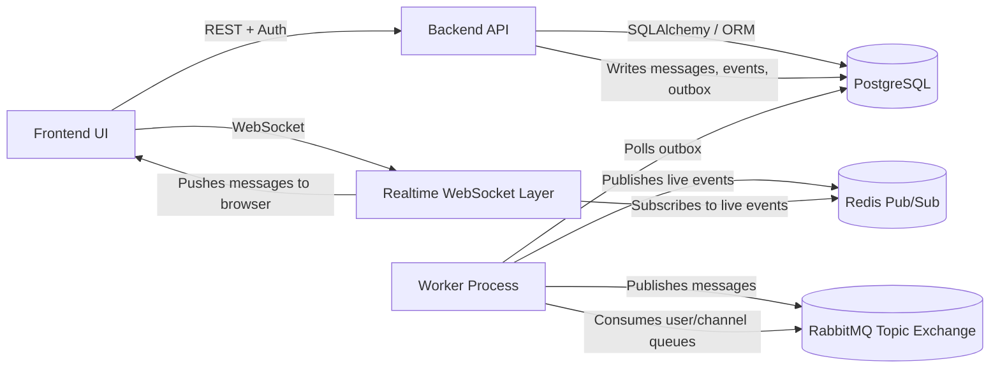

# AGENTS.md

# Distributed Publish/Subscribe Messaging System — Agent Instructions

This file is the source of truth for AI coding agents working on this repository.

The project is a fourth-year university graduation project for Networks and Operating Systems.

Project title:

**Building a Distributed Messaging System Based on the Publish/Subscribe Model**

The goal is to design and implement a distributed messaging system where users or applications communicate through the publish/subscribe model. Publishers send messages to specific channels/topics. Subscribers receive the messages relevant to the channels/topics they are subscribed to.

This repository should remain focused on a stable, defendable university MVP. Do not turn it into an unrelated enterprise chat platform, social network, AI product, or over-engineered microservice system.

---

# 1. High-Level Project Vision

The project demonstrates the following ideas:

1. **Publish/Subscribe messaging**

   * Users publish messages to topics/channels.
   * Users subscribe to topics/channels.
   * Messages are automatically delivered to relevant subscribers.

2. **Distributed-system architecture**

   * A backend API coordinates users, channels, messages, permissions, and persistence.
   * A message broker such as RabbitMQ handles distributed routing/fanout.
   * A worker process handles asynchronous message dispatch.
   * Realtime delivery can use WebSockets and Redis pub/sub.
   * PostgreSQL stores durable state.

3. **Network and operating-system concepts**

   * Message routing.
   * Broker queues and exchanges.
   * Asynchronous workers.
   * Durable persistence.
   * Connection handling.
   * Background processing.
   * Fault tolerance and retries.

4. **Security**

   * Authentication.
   * Authorization.
   * Channel-level permissions.
   * Message encryption.
   * Secure access to uploaded or attached content.
   * Audit/event logging.

5. **Management interface**

   * Users can manage channels/topics.
   * Users can manage subscribers/memberships.
   * Users can publish and receive messages.
   * Users can view event logs and activity.

6. **Final submission readiness**

   * The system must be easy to run.
   * The system must have a clear demo flow.
   * The system must have tests or verification scripts.
   * The system must be documented well enough for a supervisor to understand and evaluate.

---

# 2. Official Minimum Requirements

The project must satisfy these minimum requirements.

## Requirement 1 — Create Topics/Channels

The system must allow users to create channels/topics for publish/subscribe messaging.

A channel/topic should have at least:

* unique identity,
* human-readable name,
* safe slug or internal routing identifier,
* owner or creator,
* membership/subscription information,
* creation timestamp.

## Requirement 2 — Publish to a Channel and Automatically Deliver to Subscribers

The system must allow a user to publish a message to a specific channel/topic.

Subscribers to that channel/topic should receive the message automatically.

Delivery can be supported through:

* broker routing,
* worker dispatch,
* WebSocket realtime push,
* REST backfill/sync,
* persistent database history.

The implementation should prove that one publisher can send a message and multiple subscribers can receive it.

## Requirement 3 — Management Interfaces for Channels and Subscribers

The system must provide APIs and/or UI for:

* creating channels,
* listing channels,
* viewing channel details,
* joining channels,
* leaving channels,
* inviting users,
* approving or removing subscribers,
* managing member roles or permissions,
* listing subscribers/members.

A frontend UI is strongly preferred because it makes the project easier to demonstrate.

## Requirement 4 — Security Mechanisms

The system must include:

* user authentication,
* authorization and role checks,
* message encryption or clear encryption-at-rest design,
* access control for private content,
* safe handling of secrets,
* safe validation of user-controlled identifiers.

Security does not need to be enterprise-grade, but it must not contain obvious holes that would embarrass the project.

## Requirement 5 — Event Log / Activity Log

The system must log important events, such as:

* user registration/login,
* channel creation,
* membership changes,
* message publication,
* unauthorized access attempts,
* upload/download access,
* broker or delivery failures when relevant.

The event log should be visible through an API and preferably through the frontend.

---

# 3. Recommended / Advanced Requirements

These are useful but secondary. Do not prioritize them before the MVP is stable.

## Message Broker

RabbitMQ is the preferred broker for this project because it clearly demonstrates:

* exchanges,
* queues,
* routing keys,
* bindings,
* durable queues,
* acknowledgments,
* publisher confirms,
* fanout/topic routing.

Kafka can also be used, but do not migrate from RabbitMQ to Kafka unless explicitly requested.

## Docker

Docker and Docker Compose should be the canonical way to run the project.

A supervisor should be able to run:

```bash
docker compose up --build
```

and get:

* PostgreSQL,
* RabbitMQ,
* Redis if used,
* backend,
* worker,
* frontend.

## Data Integrity / Hashing / Merkle Trees

Hashing or Merkle trees are optional/advanced.

If implemented, prefer a simple and explainable mechanism:

* hash each message/event payload,
* maintain a hash chain for channel events,
* expose a verification endpoint,
* document how integrity verification works.

Do not add a complex Merkle system unless the core MVP is already stable.

## AI / Anomaly Detection

AI-based anomaly detection is optional only.

Do not add AI features unless explicitly requested. If added, keep it lightweight:

* detect unusual message spikes,
* detect unusually frequent failed access attempts,
* detect abnormal channel activity.

The project should not become an AI project. Its main identity is distributed publish/subscribe messaging.

---

# 4. Current Expected Architecture

Agents must inspect the repository before making claims, but the expected architecture is:



The expected runtime components are:

* FastAPI backend,
* PostgreSQL database,
* RabbitMQ broker,
* Redis for realtime fanout if used,
* worker process,
* Next.js frontend,
* Docker Compose.

Do not remove distributed components unless the user explicitly asks to simplify the project.

---

# 5. Architectural Principles

Follow these principles when changing the code.

## Preserve the MVP

The priority is to stabilize the existing MVP, not rewrite it.

Do:

* fix security holes,
* improve validation,
* add tests,
* improve documentation,
* make the demo reliable,
* make behavior easier to explain.

Do not:

* rewrite the whole architecture,
* replace the backend framework,
* replace RabbitMQ without permission,
* replace the frontend framework without permission,
* add large unrelated features,
* introduce unnecessary microservices,
* create complex abstractions that are hard to defend.

## Keep Responsibilities Clear

Use this separation:

* API routes/controllers:

  * request parsing,
  * authentication dependency,
  * response shaping,
  * minimal transport-level logic.

* Services:

  * business logic,
  * permissions,
  * publishing,
  * membership rules,
  * event logging,
  * validation beyond schema-level checks.

* Database models/repositories:

  * persistence,
  * relationships,
  * queries.

* Broker modules:

  * RabbitMQ topology,
  * exchanges,
  * queues,
  * bindings,
  * routing keys,
  * publisher confirms.

* Worker:

  * outbox polling,
  * broker publishing,
  * message consumption,
  * retry handling,
  * realtime bridge.

* Frontend:

  * login/register,
  * channel management,
  * membership management,
  * publishing,
  * message display,
  * event log display,
  * user feedback.

## Prefer Small Reviewable Changes

Each change should be:

* minimal,
* localized,
* testable,
* documented,
* easy to explain.

Avoid broad rewrites unless a targeted fix is impossible.

---

# 6. Publish/Subscribe Correctness Rules

The system must behave like a real pub/sub system.

## Channels / Topics

Channels are the application-level topics.

A channel should map safely to a broker routing key or internal broker identifier.

Do not directly use unsafe user input in RabbitMQ routing keys.

## Publishing

When a user publishes a message:

1. Authenticate the user.
2. Check the user has permission to publish in the channel.
3. Validate the message.
4. Encrypt content at rest if encryption is enabled.
5. Store the message in PostgreSQL.
6. Write an outbox entry in the same transaction when possible.
7. Log a `message.published` event.
8. Let the worker publish the message to the broker.
9. Deliver the message to subscribed users.
10. Allow REST backfill/sync for missed messages.

## Subscribing

When a user subscribes/joins/is added to a channel:

1. Authenticate the user.
2. Check channel join policy and permissions.
3. Store membership in PostgreSQL.
4. Bind the user queue or subscription route in RabbitMQ.
5. Log a membership event.
6. Notify active WebSocket sessions if needed.

## Delivery

The system should support:

* realtime delivery to online subscribers,
* message history through REST,
* sync/backfill for missed messages,
* multiple subscribers receiving the same message.

## Offline Users

The preferred behavior:

* Messages are persisted in PostgreSQL.
* Offline users can fetch missed messages through REST sync/backfill.
* RabbitMQ durable queues may also support offline delivery, but PostgreSQL is the source of truth.

## Ordering

Preferred ordering:

* per-channel message sequence,
* stable ordering by channel sequence or creation time,
* no global ordering guarantee across all channels.

Document any ordering limitations.

## Acknowledgments and Retries

The worker should use:

* publisher confirms where possible,
* acknowledgments for consumed broker messages,
* retry/backoff for failed outbox publishing,
* event logging for repeated failures.

A dead-letter queue is nice to have but not mandatory for the MVP.

---

# 7. RabbitMQ Routing-Key Safety

RabbitMQ topic exchanges use special routing-key/binding semantics. User-controlled values must not accidentally become broker wildcards or ambiguous routing patterns.

Unsafe characters include:

* `.`
* `*`
* `#`
* whitespace,
* `/`
* `\`
* control characters.

Preferred safe regex for channel slugs and usernames:

```text
^[A-Za-z0-9_-]{3,50}$
```

Alternative:

* Use UUIDs or database IDs internally for routing keys.
* Keep human-readable slugs only in the database/UI.
* Generate broker-safe identifiers like:

  * `channel.<channel_uuid>`
  * `user.<user_uuid>`

Never use raw, unvalidated user input directly in:

* routing keys,
* queue names,
* exchange names,
* Redis pub/sub channel names,
* filesystem paths.

---

# 8. Security Source of Truth

Security is a core requirement of the project.

The project does not need enterprise security, but it must satisfy a credible university-level security baseline.

## Authentication

Users must authenticate before accessing protected APIs.

Preferred:

* password hashing with Argon2 or bcrypt,
* access tokens with short lifetime,
* refresh-token flow or session revocation,
* rate limiting on login/register.

Avoid:

* plain-text passwords,
* weak hashing,
* tokens without expiration,
* authentication bypasses.

## Password Storage

Passwords must never be stored in plain text.

Use:

* Argon2, bcrypt, or another strong password hashing algorithm,
* per-password salts handled by the library,
* no custom password hashing.

## Authorization

Authentication is not enough.

Every sensitive action must check authorization:

* create channel,
* update channel,
* delete channel,
* publish message,
* read channel messages,
* join private channel,
* approve members,
* invite users,
* remove users,
* access uploads,
* view event logs.

Use explicit permission checks.

Examples:

* only channel members can read messages,
* only users with publish permission can publish,
* only admins/owners can manage members,
* only authorized users can access private uploads.

## Upload and Attachment Security

Uploaded content must not be public by accident.

For every endpoint that returns upload metadata or file content:

1. Require authenticated user.
2. Load the upload record.
3. Determine whether the upload is linked to a message/channel/user.
4. Check that the current user has permission to access it.
5. Return `403 Forbidden` if not authorized.
6. Return `404 Not Found` if the upload does not exist.
7. Avoid leaking private file paths.

Never serve private upload bytes from an unauthenticated route.

## Message Encryption

If encryption at rest is implemented:

* encrypt message content before storing,
* decrypt only for authorized readers,
* keep encryption keys out of git,
* document key generation,
* document that all users with read permission receive decrypted content through the API.

Do not pretend encryption is end-to-end unless clients hold keys and the server cannot decrypt messages.

The likely correct wording is:

**Messages are encrypted at rest on the server side.**

## Secrets

Never commit real secrets.

Do not commit:

* `.env`,
* private keys,
* production database passwords,
* JWT secrets,
* message encryption keys,
* API keys.

Commit only:

* `.env.example`,
* documentation explaining required variables.

If a real `.env` was committed before:

* remove it from tracking,
* add `.env` to `.gitignore`,
* rotate the affected secrets if this is a real deployment.

## Token Storage

For a university MVP, browser-side token storage may be acceptable for a local demo, but it should not be presented as production-grade security.

Preferred production approach:

* httpOnly,
* Secure,
* SameSite cookies,
* CSRF protection if needed.

If the project uses localStorage or JavaScript-managed cookies:

* document it as demo-oriented,
* avoid claiming production-grade session security,
* avoid unsafe rendering that increases XSS risk.

## WebSocket Authentication

Avoid putting long-lived secrets in WebSocket query strings if possible.

Acceptable MVP options:

* short-lived access token,
* one-time WebSocket ticket,
* authenticated session cookie.

If query-token auth is used:

* use short-lived tokens,
* do not log full URLs with tokens,
* document this limitation.

## Input Validation

Validate:

* usernames,
* channel slugs,
* channel names,
* message length,
* uploaded filenames,
* file sizes,
* MIME types,
* pagination limits,
* IDs and UUIDs.

Reject unsafe inputs early with clear errors.

## Rate Limiting

Rate-limit:

* login,
* register,
* message publishing,
* upload,
* invite creation,
* expensive list/search endpoints if needed.

## Audit Events

Log important security events:

* failed login,
* unauthorized publish attempt,
* unauthorized read attempt,
* unauthorized upload access attempt,
* member promotion/demotion,
* channel deletion,
* token/session revocation.

---

# 9. Database and Persistence Rules

PostgreSQL should be the source of truth for application state.

Expected persistent entities include:

* users,
* sessions/tokens,
* channels,
* channel memberships,
* invites or join requests,
* messages,
* uploads,
* event logs,
* outbox rows,
* reactions/pins/seen markers if implemented.

## Persistence Expectations

The system should survive restarts:

* users remain,
* channels remain,
* memberships remain,
* messages remain,
* event logs remain,
* outbox retry state remains.

## Transactions

Use transactions for related state changes.

Examples:

* creating a message + outbox row + event log,
* creating a channel + owner membership + event log,
* changing membership + event log.

When broker operations happen after DB commit, document the possible consistency gap and use retries or repair where practical.

## Outbox Pattern

For reliable publishing:

1. Store message in database.
2. Store outbox event in database.
3. Commit database transaction.
4. Worker reads pending outbox events.
5. Worker publishes to broker.
6. Worker marks outbox event as sent or failed.
7. Worker retries failed events.

This is a good architecture for the project and should be preserved.

---

# 10. Event Logging Rules

Event logging is required.

Important event types:

* `user.registered`
* `user.login`
* `user.logout`
* `channel.created`
* `channel.updated`
* `channel.deleted`
* `member.joined`
* `member.left`
* `member.invited`
* `member.approved`
* `member.removed`
* `member.promoted`
* `member.demoted`
* `message.published`
* `message.edited`
* `message.deleted`
* `upload.created`
* `upload.accessed`
* `security.unauthorized_access`
* `broker.publish_failed`
* `broker.delivery_failed`

Event logs should include:

* actor user ID when available,
* channel ID when relevant,
* message ID when relevant,
* event type,
* timestamp,
* metadata payload.

Do not log secrets or full tokens.

---

# 11. Frontend Requirements

The frontend should support the demo flow.

Minimum useful UI:

* login,
* register,
* channel list,
* create channel,
* channel view,
* publish message,
* realtime or refreshed message display,
* join/leave channel,
* member management,
* event log view.

Nice-to-have UI:

* invite links,
* role management,
* message reactions,
* pinned messages,
* upload attachments,
* profile/session management,
* simple health/status page.

The frontend should make the project easy to demonstrate. Do not spend time making it visually perfect before security/testing/docs are stable.

---

# 12. Testing Source of Truth

Testing must prove the MVP works.

Do not chase full enterprise test coverage. Prioritize high-value tests.

## Required Tests / Checks

At minimum, there should be tests or scripts proving:

1. User can register/login.
2. User can create a channel.
3. A second user can join or be added.
4. A publisher can publish a message to the channel.
5. A subscriber can receive or sync that message.
6. Unauthorized users cannot read private channel data.
7. Unauthorized users cannot access private upload content.
8. Unsafe channel slugs/usernames are rejected.
9. Event logs are created for key actions.

## Ideal Integration Test

A single high-value integration/smoke test should prove:

```text
register user A
register user B
A creates channel
B joins or is added
B opens WebSocket or sync endpoint
A publishes message
message is delivered or syncable for B
event log contains channel/message activity
unauthorized user C cannot access the channel/upload
```

## Useful Commands

Common commands may include:

```bash
python -m pytest -q
npm run typecheck
docker compose up --build
docker compose ps
python scripts/verify_demo_flow.py --base-url http://localhost:8000/v1
```

Agents must inspect the actual repository scripts before assuming exact command names.

## Test Philosophy

Prefer:

* integration tests over tiny isolated unit tests,
* tests that match the demo flow,
* regression tests for known security bugs,
* smoke tests that a supervisor can understand.

---

# 13. Docker and Deployment Rules

Docker Compose should remain the canonical run path.

A clean evaluator should be able to:

1. Clone the repository.
2. Copy `.env.example` to `.env`.
3. Fill required secrets.
4. Run `docker compose up --build`.
5. Open the frontend.
6. Complete the demo flow.

## Required Documentation

The README or deployment guide must explain:

* prerequisites,
* environment variables,
* how to generate encryption keys,
* how to start Docker Compose,
* backend URL,
* frontend URL,
* RabbitMQ management URL if exposed,
* how to run tests,
* how to run the demo verifier,
* common troubleshooting steps.

## Environment Variables

Use `.env.example` for documentation.

Required variables should be described clearly:

* database URL,
* RabbitMQ URL,
* Redis URL,
* JWT secret,
* message encryption key,
* frontend API URL,
* CORS settings.

Do not commit real `.env`.

---

# 14. Documentation Requirements

Documentation is part of the final project, not an afterthought.

The repository should include:

## README.md

Must explain:

* project purpose,
* architecture summary,
* features,
* setup,
* running,
* testing,
* demo accounts if any,
* known limitations.

## docs/ARCHITECTURE.md

Must explain:

* backend,
* frontend,
* database,
* broker,
* worker,
* Redis/WebSocket flow,
* outbox pattern,
* message lifecycle.

## docs/REQUIREMENTS_MAPPING.md

Must map each official requirement to:

* implementation status,
* files/modules,
* how to test/demo it.

Do not exaggerate. Use honest labels:

* complete,
* mostly complete,
* partial,
* missing,
* optional.

## docs/SECURITY.md

Must explain:

* authentication,
* authorization,
* message encryption,
* token/session limitations,
* upload access policy,
* routing-key safety,
* known security limitations.

## docs/DEMO_GUIDE.md

Must provide a step-by-step supervisor demo:

1. Start system.
2. Register/login.
3. Create channel.
4. Add/join subscriber.
5. Publish message.
6. Show subscriber receives it.
7. Show event log.
8. Show unauthorized access blocked.
9. Show RabbitMQ/worker logs if useful.

## docs/TESTING.md

Must explain:

* unit tests,
* integration tests,
* smoke/demo verifier,
* manual tests,
* expected outputs.

## Final Report

A final Arabic or English report should be prepared separately if required by the university. The report should explain the project academically, not just as code.

---

# 15. MVP Stabilization Priorities

When asked to stabilize the MVP, follow this exact priority order.

## Priority 1 — Security Holes

Fix first:

* unauthenticated upload/content endpoints,
* missing authorization checks,
* committed secrets,
* unsafe token claims in documentation,
* unsafe routing-key identifiers.

## Priority 2 — Pub/Sub Correctness

Fix:

* unsafe RabbitMQ routing keys,
* missing broker bindings,
* broken outbox publishing,
* WebSocket delivery gaps,
* missing sync/backfill behavior,
* offline subscriber behavior if broken.

## Priority 3 — Demo Reliability

Fix:

* Docker startup problems,
* missing `.env.example`,
* broken README commands,
* failing demo script,
* obvious frontend runtime errors,
* migration/bootstrap problems.

## Priority 4 — Tests

Add:

* regression tests for security holes,
* routing-key validation tests,
* one end-to-end smoke/integration test,
* type checks.

## Priority 5 — Documentation

Add:

* requirements mapping,
* demo guide,
* security notes,
* testing results,
* final report outline.

## Priority 6 — Nice-to-Have Features

Only after the above:

* monitoring dashboard,
* hash chain/Merkle proof,
* anomaly detection,
* load testing,
* UI polish.

---

# 16. Things Agents Must Not Do

Do not:

* remove RabbitMQ unless explicitly requested,
* remove the worker unless explicitly requested,
* remove PostgreSQL persistence unless explicitly requested,
* replace the project with a simple in-memory chat,
* add AI/anomaly detection before MVP stabilization,
* add a complex Merkle tree before core security/testing is stable,
* introduce unrelated features like payments, social feeds, notifications outside pub/sub scope,
* claim production-grade security unless it is actually implemented,
* commit real secrets,
* use raw user input in routing keys or file paths,
* silently weaken authorization to make tests pass,
* change public behavior without updating docs/tests,
* make broad rewrites when a targeted fix is enough.

---

# 17. Definition of Done for Stabilization

A stabilization task is done only when:

1. The relevant code is fixed.
2. A regression test or verification step exists.
3. Existing tests still pass or failures are documented.
4. Docker run path is not broken.
5. Documentation is updated if behavior changed.
6. Security implications are documented honestly.
7. The final response lists:

   * files changed,
   * what changed,
   * tests run,
   * results,
   * remaining risks.

---

# 18. Definition of Done for Final MVP

The project is ready for final university MVP submission when:

1. A user can register/login.
2. A user can create a channel/topic.
3. Another user can join or be added.
4. A publisher can publish a message to the channel.
5. Subscribers can receive the message through realtime delivery or sync/backfill.
6. Messages are persisted.
7. Channel memberships are persisted.
8. Event logs are created and visible.
9. Unauthorized access is blocked.
10. Private uploads are not public.
11. Message encryption at rest is implemented or clearly documented.
12. RabbitMQ or another broker is part of the actual flow.
13. Docker Compose can run the system.
14. A demo script exists.
15. A testing document exists.
16. A final report or report outline exists.
17. The README explains how to run and test the project.

---

# 19. Suggested Supervisor Demo Flow

Use this flow for demo-oriented work:

1. Start Docker Compose.
2. Open frontend.
3. Register/login as User A.
4. Register/login as User B in another browser/session.
5. User A creates a channel.
6. User A invites User B or User B joins the channel.
7. User A publishes a message.
8. User B receives the message automatically.
9. User B replies.
10. Show messages stored after refresh.
11. Show event log for channel activity.
12. Show unauthorized user cannot access private channel or private upload.
13. Show RabbitMQ management UI or logs to prove broker involvement.
14. Show backend/worker logs.
15. Show tests or demo verifier output.

---

# 20. Final Project Framing

When explaining the project, use this framing:

This project is not just a chat application. It is a distributed publish/subscribe messaging system with persistent topics, subscriber management, broker-based routing, asynchronous workers, realtime delivery, authentication, authorization, encryption at rest, and event logging.

The chat-like UI is only the demonstration interface. The real academic focus is the architecture and behavior of the publish/subscribe system.

---

# 21. Agent Response Format

When completing a task, agents should respond with:

```text
Summary:
- ...

Files changed:
- path: reason

Tests run:
- command: result

Security impact:
- ...

Remaining risks:
- ...

Recommended next steps:
- ...
```

Be honest about anything not verified.
