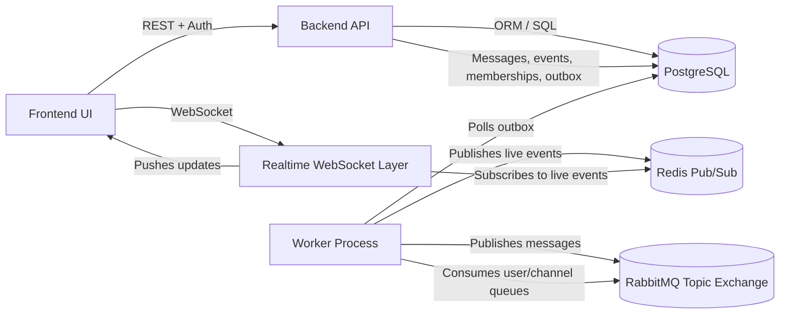

# AGENTS.md

# Distributed Publish/Subscribe Messaging System — Agent Source of Truth

This file is the source of truth for AI coding agents working on this repository.

The project is a fourth-year university graduation project for the Networks and Operating Systems specialization.

Project title:

**Building a Distributed Messaging System Based on the Publish/Subscribe Model**

The project goal is to design and implement a distributed messaging system where applications or users communicate through the publish/subscribe model. Publishers send messages to specific channels/topics. Subscribers automatically receive messages from the channels/topics they are subscribed to.

The repository should remain focused on a stable, defendable university MVP. Do not transform it into an unrelated chat app, social network, enterprise messaging platform, AI product, or over-engineered microservice system.

---

# 1. How Agents Must Use This File

Before making changes, agents must:

1. Read this file.
2. Treat this file as the project source of truth.
3. Inspect the current repository before making claims.
4. Prefer small, reviewable, testable changes.
5. Avoid broad rewrites unless explicitly requested.
6. Keep documentation and assessment files synchronized with code changes.
7. Be honest about what is implemented, partially implemented, missing, risky, or unverified.

When a user asks for stabilization, reassessment, cleanup, final-MVP preparation, or security fixes, agents must follow the priority order defined in this file.

---

# 2. Project Identity

This project is:

**A distributed publish/subscribe messaging system with persistent channels, subscriber management, broker-based routing, asynchronous workers, realtime delivery, authentication, authorization, encryption-at-rest, event logging, and a web management interface.**

This project is not merely a chat application.

The chat-like frontend is only the demonstration interface. The academic focus is the architecture and behavior of the publish/subscribe system.

Use this framing in documentation, reports, comments, and final explanations:

> The system demonstrates a distributed publish/subscribe architecture using persistent topics/channels, broker-based message routing, subscriber management, asynchronous delivery, realtime updates, security mechanisms, and audit/event logging.

---

# 3. Official Minimum Requirements

The system must satisfy the following minimum requirements.

## Requirement 1 — Create Topics/Channels

The system must allow users to create channels/topics for publish/subscribe messaging.

A channel/topic should have at least:

* unique identity,
* human-readable name,
* safe slug or internal routing identifier,
* owner or creator,
* membership/subscription information,
* creation timestamp.

A channel/topic is the application-level abstraction of a publish/subscribe topic.

## Requirement 2 — Publish to a Channel and Automatically Deliver to Subscribers

The system must allow a user to publish a message to a specific channel/topic.

Subscribers to that channel/topic should receive the message automatically.

Delivery may be implemented through:

* RabbitMQ or another message broker,
* worker-based dispatch,
* Redis pub/sub bridge,
* WebSocket realtime push,
* REST sync/backfill,
* persistent database message history.

The implementation should prove that one publisher can send a message and one or more subscribers can receive it.

## Requirement 3 — Management Interfaces for Channels and Subscribers

The system must provide APIs and preferably a frontend UI for:

* creating channels,
* listing channels,
* viewing channel details,
* updating channels,
* deleting channels if supported,
* joining channels,
* leaving channels,
* inviting users,
* approving join requests,
* removing subscribers,
* managing member roles,
* managing permissions,
* listing subscribers/members.

The UI does not need to be visually perfect, but it must support a clear supervisor demo.

## Requirement 4 — Security Mechanisms

The system must include credible university-level security mechanisms:

* user authentication,
* password hashing,
* session or token management,
* authorization and role checks,
* channel-level permissions,
* message encryption or clearly documented encryption-at-rest,
* safe access control for uploads/attachments,
* safe validation of user-controlled identifiers,
* protection against obvious security holes,
* secret management through environment variables.

The project does not need enterprise-grade production security, but it must not contain obvious vulnerabilities that would embarrass the project during evaluation.

## Requirement 5 — Event Log / Activity Log

The system must maintain an event/activity log for important operations.

Important events include:

* user registration,
* login/logout,
* channel creation/update/deletion,
* membership changes,
* invitations,
* join requests,
* member approval/removal,
* role changes,
* message publication,
* message edit/delete if implemented,
* upload creation/access if implemented,
* unauthorized access attempts,
* broker publish/delivery failures if relevant.

The event log should be visible through an API and preferably through the frontend.

---

# 4. Recommended and Advanced Requirements

These are useful but secondary. Do not prioritize them before the MVP is secure, stable, tested, and documented.

## Message Broker

RabbitMQ is the preferred broker unless the repository already uses something else or the user explicitly requests a migration.

RabbitMQ is useful because it demonstrates:

* exchanges,
* queues,
* routing keys,
* bindings,
* topic routing,
* durable queues,
* acknowledgments,
* publisher confirms,
* asynchronous fanout.

Do not replace RabbitMQ with Kafka or another broker unless explicitly requested.

## Docker

Docker Compose should be the canonical run path.

A fresh evaluator should ideally be able to run:

```bash
docker compose up --build
```

and get:

* PostgreSQL,
* RabbitMQ,
* Redis if used,
* backend,
* worker,
* frontend.

## Data Integrity / Hashing / Merkle Trees

Hashing or Merkle trees are optional/advanced.

If implemented, keep it simple and explainable:

* hash each message or event payload,
* maintain a hash chain for channel events,
* compute a Merkle root over message/event batches,
* expose a verification endpoint,
* document what integrity guarantee is actually provided.

Do not add a complex Merkle system before core security, testing, demo reliability, and documentation are stable.

## AI / Anomaly Detection

AI-based anomaly detection is optional only.

Do not add AI features unless explicitly requested.

If added, keep it lightweight:

* unusual message-rate spikes,
* repeated failed access attempts,
* abnormal channel activity,
* suspicious publish frequency.

The project should not become an AI project. Its main identity is distributed publish/subscribe messaging.

---

# 5. Expected Architecture

Agents must inspect the actual repository before making claims, but the expected architecture is:



Expected runtime components:

* FastAPI backend,
* PostgreSQL database,
* RabbitMQ broker,
* Redis for realtime fanout if used,
* worker process,
* Next.js frontend,
* Docker Compose.

Do not remove distributed components unless the user explicitly asks to simplify the project.

---

# 6. Architectural Principles

## Preserve the MVP

The priority is to stabilize the existing MVP, not rewrite it.

Do:

* fix security holes,
* improve validation,
* improve pub/sub correctness,
* add high-value tests,
* make the demo reliable,
* improve documentation,
* keep requirements mapping honest,
* make behavior easier to explain.

Do not:

* rewrite the whole architecture,
* replace the backend framework,
* replace the frontend framework,
* replace RabbitMQ without permission,
* replace PostgreSQL without permission,
* remove the worker without permission,
* remove Redis/WebSocket delivery without permission,
* introduce unnecessary microservices,
* add unrelated features,
* create complex abstractions that are hard to defend.

## Keep Responsibilities Clear

Use this separation:

### API Routes / Controllers

Responsible for:

* request parsing,
* authentication dependency,
* response shaping,
* minimal transport-level logic.

Not responsible for heavy business logic.

### Services

Responsible for:

* business rules,
* permissions,
* publishing logic,
* channel logic,
* membership logic,
* event logging,
* validation beyond schema-level checks,
* orchestration between database, broker, and event log.

### Database Models / Repositories

Responsible for:

* persistence,
* relationships,
* queries,
* transactions,
* constraints.

### Broker Modules

Responsible for:

* RabbitMQ topology,
* exchange declarations,
* queue declarations,
* bindings,
* routing-key construction,
* publisher confirms,
* message acknowledgments.

### Worker

Responsible for:

* outbox polling,
* broker publishing,
* message consumption,
* retry handling,
* realtime bridge,
* failure logging.

### Frontend

Responsible for:

* login/register,
* channel management,
* membership management,
* publishing,
* message display,
* realtime updates,
* event log display,
* user-facing demo flow.

---

# 7. Publish/Subscribe Correctness Rules

The system must behave like a real publish/subscribe system.

## Channels / Topics

Channels are the application-level topics.

A channel should map safely to a broker routing key or internal broker identifier.

Do not directly use unsafe user input in RabbitMQ routing keys.

## Publishing Flow

When a user publishes a message:

1. Authenticate the user.
2. Check that the user has permission to publish in the channel.
3. Validate the message.
4. Encrypt content at rest if encryption is enabled.
5. Store the message in PostgreSQL.
6. Write an outbox entry in the same transaction when possible.
7. Log a `message.published` event.
8. Let the worker publish the message to RabbitMQ.
9. Deliver the message to subscribed users.
10. Allow REST sync/backfill for missed messages.

## Subscription Flow

When a user subscribes, joins, is invited, or is added to a channel:

1. Authenticate the user.
2. Check channel join policy and permissions.
3. Store membership in PostgreSQL.
4. Bind the user queue or subscription route in RabbitMQ if applicable.
5. Log a membership event.
6. Notify active WebSocket sessions if needed.

## Delivery

The system should support:

* realtime delivery to online subscribers,
* persistent message history,
* sync/backfill for missed messages,
* multiple subscribers receiving the same message,
* refresh-safe message loading.

## Offline Users

Preferred behavior:

* Messages are persisted in PostgreSQL.
* Offline users can fetch missed messages through REST sync/backfill.
* RabbitMQ durable queues may also support offline delivery.
* PostgreSQL remains the source of truth.

## Ordering

Preferred ordering:

* per-channel message sequence,
* stable ordering by channel sequence or creation time,
* no global ordering guarantee across all channels.

Document any ordering limitations honestly.

## Acknowledgments and Retries

The worker should use:

* publisher confirms where possible,
* acknowledgments for consumed broker messages,
* retry/backoff for failed outbox publishing,
* event logging for repeated failures.

A dead-letter queue is nice to have but not mandatory for the MVP.

---

# 8. RabbitMQ and Routing-Key Safety

RabbitMQ topic exchanges have special routing-key and binding semantics. User-controlled values must not accidentally become wildcards, routing patterns, or ambiguous broker identifiers.

Unsafe characters include:

* `.`
* `*`
* `#`
* whitespace,
* `/`
* `\`
* control characters.

Preferred safe regex for channel slugs and usernames:

```text
^[A-Za-z0-9_-]{3,50}$
```

Alternative design:

* use UUIDs or database IDs internally for broker routing,
* keep human-readable slugs only in the database/UI,
* generate broker-safe identifiers such as:

  * `channel.<channel_uuid>`
  * `user.<user_uuid>`

Never use raw, unvalidated user input directly in:

* routing keys,
* queue names,
* exchange names,
* Redis pub/sub channel names,
* filesystem paths.

If validation is changed, update:

* schemas,
* service-level validation,
* database constraints if appropriate,
* tests,
* docs,
* assessment/status files.

---

# 9. Security Source of Truth

Security is a core requirement.

The project does not need enterprise security, but it must satisfy a credible university-level security baseline.

## Authentication

Users must authenticate before accessing protected APIs.

Preferred:

* password hashing with Argon2 or bcrypt,
* access tokens with short lifetime,
* refresh-token flow or session revocation,
* rate limiting on login/register.

Avoid:

* plain-text passwords,
* weak password hashing,
* tokens without expiration,
* authentication bypasses.

## Password Storage

Passwords must never be stored in plain text.

Use:

* Argon2, bcrypt, or another strong password hashing algorithm,
* per-password salts handled by the library,
* no custom password hashing.

## Authorization

Authentication is not enough.

Every sensitive action must check authorization:

* create channel,
* update channel,
* delete channel,
* publish message,
* read channel messages,
* sync channel messages,
* join private channel,
* approve members,
* invite users,
* remove users,
* access uploads,
* access upload content,
* view event logs,
* manage roles and permissions.

Examples:

* only channel members can read private channel messages,
* only users with publish permission can publish,
* only admins/owners can manage members,
* only authorized users can access private uploads,
* unauthorized attempts should return `403 Forbidden` or an appropriate error.

## Upload and Attachment Security

Uploaded content must not be public by accident.

For every endpoint that returns upload metadata or file content:

1. Require authenticated user.
2. Load the upload record.
3. Determine whether the upload is linked to a message, channel, or user.
4. Check that the current user has permission to access it.
5. Return `403 Forbidden` if not authorized.
6. Return `404 Not Found` if the upload does not exist.
7. Avoid leaking private filesystem paths.
8. Log unauthorized access attempts where appropriate.

Never serve private upload bytes from an unauthenticated route.

If upload authorization is fixed, update all relevant assessment/status documents.

## Message Encryption

If encryption at rest is implemented:

* encrypt message content before storing,
* decrypt only for authorized readers,
* keep encryption keys out of git,
* document key generation,
* document what is encrypted and what is not encrypted,
* document that the server can decrypt messages if using server-side encryption.

Do not claim end-to-end encryption unless clients hold keys and the server cannot decrypt messages.

The likely correct wording is:

> Messages are encrypted at rest using server-side encryption.

## Secrets

Never commit real secrets.

Do not commit:

* `.env`,
* private keys,
* production database passwords,
* JWT secrets,
* message encryption keys,
* API keys,
* refresh-token signing secrets.

Commit only:

* `.env.example`,
* documentation explaining required variables.

If a real `.env` was committed before:

1. remove it from tracking,
2. add `.env` to `.gitignore`,
3. rotate affected secrets if this is a real deployment,
4. update documentation,
5. update assessment/status documents.

## Token Storage

For a university MVP, browser-side token storage may be acceptable for a local demo, but it must not be presented as production-grade security.

Preferred production approach:

* `httpOnly` cookies,
* `Secure` cookies,
* `SameSite` cookies,
* CSRF protection if needed.

If the project uses localStorage or JavaScript-managed cookies:

* document it as demo-oriented,
* avoid claiming production-grade session security,
* avoid unsafe rendering that increases XSS risk,
* mention the limitation in security documentation.

## WebSocket Authentication

Avoid putting long-lived secrets in WebSocket query strings if possible.

Acceptable MVP options:

* short-lived access token,
* one-time WebSocket ticket,
* authenticated session cookie.

If query-token WebSocket auth is used:

* use short-lived tokens,
* do not log full URLs with tokens,
* document the limitation.

## Input Validation

Validate:

* usernames,
* channel slugs,
* channel names,
* message length,
* uploaded filenames,
* file sizes,
* MIME types,
* pagination limits,
* UUIDs and IDs,
* role values,
* permission values.

Reject unsafe inputs early with clear errors.

## Rate Limiting

Rate-limit:

* login,
* register,
* message publishing,
* uploads,
* invite creation,
* expensive list/search endpoints if needed.

## Audit Events

Log important security events:

* failed login,
* unauthorized publish attempt,
* unauthorized read attempt,
* unauthorized upload access attempt,
* member promotion/demotion,
* channel deletion,
* token/session revocation,
* repeated broker failures.

Do not log:

* passwords,
* full tokens,
* encryption keys,
* private secrets,
* raw sensitive file paths.

---

# 10. Database and Persistence Rules

PostgreSQL should be the source of truth for application state.

Expected persistent entities include:

* users,
* sessions/tokens,
* channels,
* channel memberships,
* invites or join requests,
* messages,
* uploads,
* event logs,
* outbox rows,
* reactions/pins/seen markers if implemented.

## Persistence Expectations

The system should survive restarts:

* users remain,
* channels remain,
* memberships remain,
* messages remain,
* event logs remain,
* outbox retry state remains.

## Transactions

Use transactions for related state changes.

Examples:

* creating a message + outbox row + event log,
* creating a channel + owner membership + event log,
* changing membership + event log,
* upload metadata + message linkage + event log.

When broker operations happen after DB commit, document the possible consistency gap and use retries or repair where practical.

## Outbox Pattern

For reliable publishing:

1. Store message in database.
2. Store outbox event in database.
3. Commit database transaction.
4. Worker reads pending outbox events.
5. Worker publishes to broker.
6. Worker marks outbox event as sent or failed.
7. Worker retries failed events.

This is a good architecture for the project and should be preserved.

---

# 11. Event Logging Rules

Event logging is required.

Important event types include:

* `user.registered`
* `user.login`
* `user.logout`
* `channel.created`
* `channel.updated`
* `channel.deleted`
* `member.joined`
* `member.left`
* `member.invited`
* `member.approved`
* `member.removed`
* `member.promoted`
* `member.demoted`
* `message.published`
* `message.edited`
* `message.deleted`
* `upload.created`
* `upload.accessed`
* `security.unauthorized_access`
* `broker.publish_failed`
* `broker.delivery_failed`

Event logs should include:

* actor user ID when available,
* channel ID when relevant,
* message ID when relevant,
* upload ID when relevant,
* event type,
* timestamp,
* metadata payload.

Event logging may be best-effort if failure should not block the main user action, but this limitation must be documented.

---

# 12. Frontend Requirements

The frontend should support the demo flow.

Minimum useful UI:

* login,
* register,
* channel list,
* create channel,
* channel view,
* publish message,
* realtime or refreshed message display,
* join/leave channel,
* member management,
* event log view.

Nice-to-have UI:

* invite links,
* role management,
* message reactions,
* pinned messages,
* upload attachments,
* profile/session management,
* simple health/status page.

The frontend should make the project easy to demonstrate.

Do not spend time making the frontend visually perfect before security, testing, demo reliability, and documentation are stable.

---

# 13. Testing Source of Truth

Testing must prove the MVP works.

Do not chase full enterprise test coverage. Prioritize high-value tests.

## Minimum Required Tests or Verification Scripts

At minimum, there should be tests or scripts proving:

1. User can register/login.
2. User can create a channel.
3. A second user can join or be added.
4. A publisher can publish a message to the channel.
5. A subscriber can receive or sync that message.
6. Unauthorized users cannot read private channel data.
7. Unauthorized users cannot access private upload content.
8. Unsafe channel slugs/usernames are rejected.
9. Event logs are created for key actions.

## High-Value Integration Test

A single high-value integration or smoke test should prove:

```text
register user A
register user B
register user C
A creates channel
B joins or is added
B opens WebSocket or uses sync endpoint
A publishes message
message is delivered or syncable for B
event log contains channel/message activity
C cannot access private channel data or private upload content
unsafe slugs/usernames are rejected
```

## Useful Commands

Common commands may include:

```bash
python -m pytest -q
npm run typecheck
docker compose up --build
docker compose ps
python scripts/verify_demo_flow.py --base-url http://localhost:8000/v1
```

Agents must inspect the actual repository scripts before assuming exact command names.

## Test Philosophy

Prefer:

* integration tests over tiny isolated unit tests,
* tests that match the supervisor demo flow,
* regression tests for known security bugs,
* smoke tests that a supervisor can understand.

Avoid:

* brittle tests that depend on exact UI pixel layout,
* huge test rewrites,
* tests that silently bypass real security,
* tests that mock the entire pub/sub system when the purpose is to prove pub/sub behavior.

---

# 14. Docker and Deployment Rules

Docker Compose should remain the canonical run path.

A clean evaluator should be able to:

1. Clone the repository.
2. Copy `.env.example` to `.env`.
3. Fill required secrets.
4. Run `docker compose up --build`.
5. Open the frontend.
6. Complete the demo flow.

## Required Deployment Documentation

The README or deployment guide must explain:

* prerequisites,
* environment variables,
* how to generate encryption keys,
* how to start Docker Compose,
* backend URL,
* frontend URL,
* RabbitMQ management URL if exposed,
* how to run tests,
* how to run the demo verifier,
* common troubleshooting steps.

## Environment Variables

Use `.env.example` for documentation.

Required variables should be described clearly:

* database URL,
* RabbitMQ URL,
* Redis URL,
* JWT secret,
* message encryption key,
* frontend API URL,
* CORS settings.

Do not commit real `.env`.

---

# 15. Documentation Requirements

Documentation is part of the final project, not an afterthought.

The repository should include or eventually include the following.

## README.md

Must explain:

* project purpose,
* architecture summary,
* features,
* setup,
* running,
* testing,
* demo accounts if any,
* known limitations.

## docs/ARCHITECTURE.md

Must explain:

* backend,
* frontend,
* database,
* RabbitMQ,
* worker,
* Redis/WebSocket flow,
* outbox pattern,
* message lifecycle,
* delivery guarantees and limitations.

## docs/REQUIREMENTS_MAPPING.md

Must map each official requirement to:

* implementation status,
* files/modules,
* how to test/demo it,
* remaining gaps.

Do not exaggerate. Use honest labels:

* Complete,
* Mostly complete,
* Partial,
* Started but weak,
* Missing,
* Cannot verify.

## docs/SECURITY.md

Must explain:

* authentication,
* authorization,
* message encryption,
* token/session limitations,
* upload access policy,
* routing-key safety,
* known security limitations.

## docs/DEMO_GUIDE.md

Must provide a step-by-step supervisor demo:

1. Start system.
2. Register/login.
3. Create channel.
4. Add/join subscriber.
5. Publish message.
6. Show subscriber receives it.
7. Show event log.
8. Show unauthorized access blocked.
9. Show RabbitMQ/worker logs if useful.

## docs/TESTING.md

Must explain:

* unit tests,
* integration tests,
* smoke/demo verifier,
* manual tests,
* expected outputs.

## Final Report

A final Arabic or English report should be prepared separately if required by the university.

The report should explain the project academically, not only as code.

---

# 16. Assessment and Status Maintenance

Agents must keep assessment/status documents updated when their changes make old claims outdated.

This is mandatory.

## Files That Count as Assessment or Status Documents

Examples include:

* `REPOSITORY_ASSESSMENT.md`
* `REPOSITORY_ASSESSMENT*.md`
* `docs/REPOSITORY_ASSESSMENT.md`
* `docs/MVP_ASSESSMENT.md`
* `docs/MVP_STATUS.md`
* `docs/PROJECT_STATUS.md`
* `docs/REQUIREMENTS_MAPPING.md`
* `docs/SECURITY.md`
* `docs/TESTING.md`
* `docs/DEMO_GUIDE.md`

Agents must search for these files before and after stabilization tasks.

## When Agents Must Update Assessment/Status Documents

Update assessment/status documents whenever a change affects:

* requirement completion status,
* security status,
* upload access policy,
* authentication behavior,
* authorization behavior,
* encryption behavior,
* RabbitMQ routing-key safety,
* pub/sub delivery behavior,
* WebSocket behavior,
* sync/backfill behavior,
* Docker/deployment behavior,
* test coverage,
* demo flow,
* known limitations,
* remaining risks.

## Examples

If an old assessment says:

> Upload content endpoint is public.

and the agent fixes it, the agent must update the relevant assessment/status/security document to say:

* what was fixed,
* where it was fixed,
* what test verifies it,
* what risks remain.

If an old assessment says:

> Slug validation is too permissive.

and the agent adds safe slug validation, the agent must update the relevant document to say:

* what validation rule is now used,
* where it is enforced,
* what tests cover it,
* whether existing data migration risks remain.

If an old assessment says:

> Testing is weak.

and the agent adds a meaningful smoke/integration test, the agent must update the testing/status document to mention the new test, while still being honest about remaining missing tests.

## Assessment Update Rules

When updating assessment/status documents:

1. Preserve honest wording.
2. Avoid exaggerating completeness.
3. Cite concrete files/modules as evidence.
4. Mention tests or commands that verified the claim.
5. Keep unresolved risks visible.
6. Do not mark a feature `Complete` unless code and tests support it.
7. Prefer `Mostly complete` or `Partial` when runtime verification is incomplete.
8. Add a short “Last updated” note if the document already uses that style.
9. Do not hide previously discovered risks unless actually fixed.
10. Do not create fake certainty.

## If No Assessment Exists

If no assessment/status file exists, agents should not create a large assessment unless the user requested reassessment.

However, for stabilization or final-MVP tasks, agents should at minimum update or create a short `docs/MVP_STATUS.md` or update `docs/REQUIREMENTS_MAPPING.md`.

---

# 17. MVP Stabilization Priorities

When asked to stabilize the MVP, follow this exact priority order.

## Priority 1 — Security Holes

Fix first:

* unauthenticated upload/content endpoints,
* missing authorization checks,
* committed secrets,
* unsafe token claims in documentation,
* unsafe routing-key identifiers,
* unsafe file path handling.

## Priority 2 — Pub/Sub Correctness

Fix:

* unsafe RabbitMQ routing keys,
* missing broker bindings,
* broken outbox publishing,
* broken worker dispatch,
* WebSocket delivery gaps,
* missing sync/backfill behavior,
* offline subscriber behavior if broken.

## Priority 3 — Demo Reliability

Fix:

* Docker startup problems,
* missing `.env.example`,
* broken README commands,
* failing demo script,
* obvious frontend runtime errors,
* migration/bootstrap problems.

## Priority 4 — Tests

Add:

* regression tests for security holes,
* routing-key validation tests,
* one end-to-end smoke/integration test,
* type checks if already configured.

## Priority 5 — Documentation and Assessment Updates

Update:

* README,
* security notes,
* testing notes,
* demo guide,
* requirements mapping,
* repository assessment/status documents.

Do not leave stale assessment claims after fixing code.

## Priority 6 — Nice-to-Have Features

Only after the above:

* monitoring dashboard,
* hash chain/Merkle proof,
* anomaly detection,
* load testing,
* UI polish.

---

# 18. Things Agents Must Not Do

Do not:

* remove RabbitMQ unless explicitly requested,
* remove the worker unless explicitly requested,
* remove PostgreSQL persistence unless explicitly requested,
* replace the project with a simple in-memory chat,
* add AI/anomaly detection before MVP stabilization,
* add a complex Merkle tree before core security/testing is stable,
* introduce unrelated features like payments, social feeds, or generic notifications,
* claim production-grade security unless it is actually implemented,
* commit real secrets,
* use raw user input in routing keys,
* use raw user input in file paths,
* silently weaken authorization to make tests pass,
* change public behavior without updating docs/tests,
* leave stale assessment documents,
* make broad rewrites when a targeted fix is enough,
* hide failures or timeouts in the final response.

---

# 19. Definition of Done for a Stabilization Task

A stabilization task is done only when:

1. The relevant code is fixed.
2. A regression test or verification step exists.
3. Existing tests still pass or failures are documented.
4. Docker run path is not obviously broken.
5. Documentation is updated if behavior changed.
6. Assessment/status documents are updated if old claims became outdated.
7. Security implications are documented honestly.
8. Remaining risks are listed.
9. The final response lists:

   * files changed,
   * what changed,
   * tests run,
   * results,
   * remaining risks,
   * recommended next steps.

---

# 20. Definition of Done for Final University MVP

The project is ready for final university MVP submission when:

1. A user can register/login.
2. A user can create a channel/topic.
3. Another user can join or be added.
4. A publisher can publish a message to the channel.
5. Subscribers can receive the message through realtime delivery or sync/backfill.
6. Messages are persisted.
7. Channel memberships are persisted.
8. Event logs are created and visible.
9. Unauthorized channel access is blocked.
10. Private uploads are not public.
11. Message encryption at rest is implemented or clearly documented.
12. RabbitMQ or another broker is part of the actual message flow.
13. Docker Compose can run the system.
14. A demo script or demo guide exists.
15. A testing document exists.
16. A security document exists.
17. A requirements mapping document is honest and updated.
18. A final report or report outline exists.
19. The README explains how to run and test the project.
20. Known limitations are documented honestly.

---

# 21. Suggested Supervisor Demo Flow

Use this flow for demo-oriented work:

1. Start Docker Compose.
2. Open frontend.
3. Register/login as User A.
4. Register/login as User B in another browser/session.
5. Register/login as User C if testing unauthorized access.
6. User A creates a channel.
7. User A invites User B or User B joins the channel.
8. User A publishes a message.
9. User B receives the message automatically or through sync/backfill.
10. User B replies.
11. Refresh the page and show messages are persisted.
12. Show the event log for channel activity.
13. Show User C cannot access private channel data or private upload content.
14. Show RabbitMQ management UI or worker logs to prove broker involvement.
15. Show backend/worker logs.
16. Show tests or demo verifier output.
17. Explain known limitations honestly.

---

# 22. Recommended Final Report Framing

When writing the final report, use this structure:

1. Introduction.
2. Problem statement.
3. Publish/subscribe model.
4. System requirements.
5. Architecture.
6. Backend API.
7. Message broker and routing.
8. Worker and outbox pattern.
9. Database design.
10. Realtime delivery.
11. Security mechanisms.
12. Event logging.
13. Testing and verification.
14. Deployment with Docker.
15. Limitations.
16. Future work.
17. Conclusion.

Emphasize:

* RabbitMQ routing,
* distributed worker architecture,
* persistent messages,
* subscriber management,
* authentication and authorization,
* encryption at rest,
* event logging,
* Docker-based deployment.

Do not overfocus on optional AI unless actually implemented.

---

# 23. Reassessment Instructions

When asked to reassess the project, agents must produce an evidence-based report.

The reassessment must include:

1. Executive summary.
2. What is already good enough for MVP.
3. What is incomplete or risky.
4. Requirement-by-requirement status.
5. Security review.
6. Pub/sub correctness review.
7. Testing review.
8. Deployment review.
9. Documentation review.
10. Final readiness score.
11. Priority roadmap.
12. Remaining risks.
13. Recommended next steps.

Agents must cite concrete repository evidence:

* file paths,
* functions,
* classes,
* modules,
* tests,
* scripts,
* docs.

If a claim cannot be verified, say so explicitly.

Do not mark something as complete based only on intention or documentation.

---

# 24. Agent Final Response Format

When completing a task, agents should respond using this format:

```text
Summary:
- ...

Files changed:
- path: what changed and why

Security impact:
- ...

Pub/sub impact:
- ...

Tests run:
- command: result

Documentation/assessment updates:
- ...

Remaining risks:
- ...

Recommended next steps:
- ...
```

For larger stabilization tasks, use this format:

```text
# MVP Stabilization Summary

## Assessment
- ...

## Files Changed
- `path`: what changed and why

## Security Fixes
- ...

## Pub/Sub Fixes
- ...

## Tests Added or Updated
- ...

## Documentation and Assessment Updates
- ...

## Commands Run
- `command`: result

## Remaining Risks
- ...

## What I Should Do Next
- ...
```

Be honest about anything not verified.

---

# 25. Current Known Risk Themes

Agents must verify the current state before acting, but previous assessment work identified these common risk themes:

1. Upload/content endpoints may lack sufficient authorization.
2. Browser token storage may be demo-oriented rather than production-grade.
3. WebSocket token handling may need documentation or hardening.
4. Routing keys may depend on user-controlled slugs/usernames.
5. Slug/username validation may be too permissive for RabbitMQ topic routing.
6. `.env` or real secrets may be tracked.
7. Broker/WebSocket integration tests may be weak or missing.
8. Demo verifier scripts may timeout or be unreliable.
9. Requirement mapping may be optimistic.
10. Security documentation may need honest limitations.

Do not assume these risks are still present. Inspect the code. If fixed, update assessment/status documents. If still present, prioritize them according to the stabilization priorities.

---

# 26. Preferred Next Actions for MVP Stabilization

When the user says “stabilize the MVP,” the preferred action sequence is:

1. Read `AGENTS.md`.
2. Inspect repo structure.
3. Find assessment/status/docs files.
4. Reassess against official requirements.
5. Fix upload authorization if needed.
6. Fix routing-key safety if needed.
7. Remove tracked secrets if needed.
8. Add regression tests for security fixes.
9. Add routing validation tests.
10. Add one publish/subscribe smoke or integration test if feasible.
11. Run backend tests.
12. Run frontend typecheck if configured.
13. Run demo verifier if available.
14. Update docs.
15. Update assessment/status files.
16. Report changed files, tests, results, and remaining risks.

---

# 27. Final Reminder

The goal is not to make the project perfect.

The goal is to make it:

* correct enough,
* secure enough,
* testable enough,
* documented enough,
* demo-ready,
* honest,
* defendable in front of a university supervisor.

Prefer a stable, well-explained MVP over an unstable feature-rich system.
