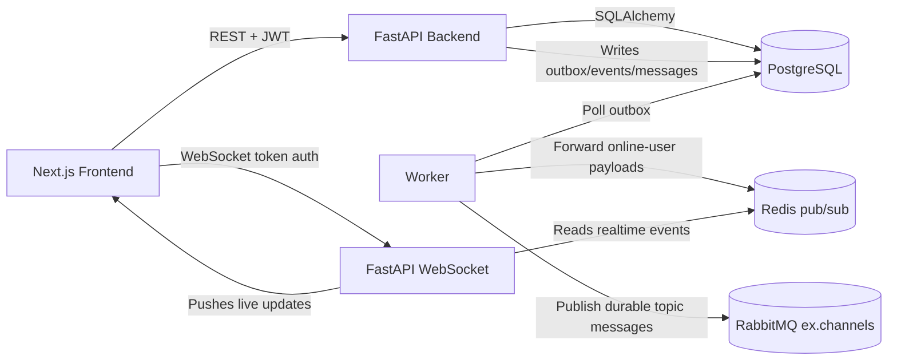

# Repository Assessment: Distributed Messaging System

Assessment of the current repository state for the graduation project:

`Building a Distributed Messaging System Based on the Publish/Subscribe Model`

This report is evidence-based and references the current codebase only. No files were modified while producing the assessment.

## 1. Executive Summary

This repository is a **late-stage university MVP / demo-ready prototype**, not production-ready.

It does more than a toy chat app:
- It has real REST APIs for channels, memberships, messages, auth, events, users, uploads, and sync.
- It persists state in PostgreSQL and uses Alembic migrations.
- It has a RabbitMQ topic exchange, an outbox worker, Redis-based realtime fanout, and WebSocket delivery.
- It has a substantial Next.js frontend for login, channel management, publishing, membership control, and event logs.
- It implements password hashing, JWT auth, role-based authorization, and Fernet message encryption at rest.

Biggest strengths:
- The pub/sub stack is real, not mocked.
- The domain model is broad and persistent.
- The UI covers the whole demo flow.
- There is genuine event logging and an outbox pattern.

Biggest risks:
- Security is not strong enough for a serious deployment.
- There is a public upload-content endpoint with no auth check.
- Frontend auth tokens are stored in localStorage and JavaScript-set cookies.
- Broker routing keys depend on user/channel slugs, but slug validation is too permissive for RabbitMQ topic routing.
- Backend test execution and the demo verifier timed out in this environment, so runtime verification is incomplete here.
- There is no Merkle tree or anomaly detection feature in the codebase.

Most urgent missing pieces:
- Fix the security holes.
- Tighten slug validation for topic routing keys.
- Verify the broker/WebSocket flow with real integration tests.
- Clarify whether the project is graded as a demo or as a security-conscious system.

## 2. Repository and Architecture Overview

### Folder Structure

- `backend/`: FastAPI backend, DB models, services, routers, migrations, and backend tests.
- `worker/`: RabbitMQ outbox publisher and online-user Redis fanout bridge.
- `frontend/`: Next.js app, UI pages, hooks, and client-side API logic.
- `docs/`: Architecture, demo, testing, and requirements mapping documentation.
- `scripts/`: Demo verification and WebSocket helper scripts.

### Main Backend Components

- [`backend/app/main.py`](backend/app/main.py)
  - Boots FastAPI.
  - Configures CORS.
  - Registers routers.
  - Declares exception handlers.
  - Installs WebSocket routes.
  - Initializes Redis, RabbitMQ, and the WebSocket manager in lifespan.
- [`backend/app/services/channel_service.py`](backend/app/services/channel_service.py)
  - Channel creation, updates, delete, membership, invites, approvals, and event retrieval.
- [`backend/app/services/message_service.py`](backend/app/services/message_service.py)
  - Publish, list, sync, seen markers, reactions, pins, uploads, and edit/delete.
- [`backend/app/services/auth_service.py`](backend/app/services/auth_service.py)
  - Register, login, refresh, logout, revoke sessions, logout all.
- [`backend/app/realtime/ws_manager.py`](backend/app/realtime/ws_manager.py)
  - WebSocket auth, subscription handling, Redis forward loop, backfill, and seen handling.
- [`backend/app/mq/publisher.py`](backend/app/mq/publisher.py)
  - Durable queue declarations and channel/user route bindings.
- [`backend/app/mq/topology.py`](backend/app/mq/topology.py)
  - RabbitMQ topic exchange declaration.
- [`backend/app/db/models.py`](backend/app/db/models.py)
  - All persistent entities.

### Frontend Components

- [`frontend/src/hooks/use-auth.ts`](frontend/src/hooks/use-auth.ts)
  - Auth lifecycle, login, register, logout, session restore.
- [`frontend/src/hooks/use-websocket.tsx`](frontend/src/hooks/use-websocket.tsx)
  - Live cache updates from WebSocket events.
- [`frontend/src/components/features/chat/pages/channel-view.tsx`](frontend/src/components/features/chat/pages/channel-view.tsx)
  - Main channel UI.
- [`frontend/src/components/features/chat/pages/channel-details.tsx`](frontend/src/components/features/chat/pages/channel-details.tsx)
  - Channel administration and event log UI.

### Database Components

PostgreSQL is the source of truth. Important entities in [`backend/app/db/models.py`](backend/app/db/models.py):
- `User`
- `UserSession`
- `Channel`
- `ChannelCounter`
- `ChannelMembership`
- `ChannelInvite`
- `Message`
- `MessageReaction`
- `PinnedMessage`
- `Upload`
- `UserChannelState`
- `Event`
- `Outbox`

### Broker / Messaging Integration

- RabbitMQ is configured as a durable topic exchange named `ex.channels`.
- Outbox rows are published by the worker to RabbitMQ.
- Online users have durable queues bound to their username and channel routes.
- Redis is used as a live pub/sub bridge for active WebSocket sessions.

### Docker / Deployment Setup

- [`docker-compose.yml`](docker-compose.yml) defines PostgreSQL, RabbitMQ, Redis, backend, worker, and frontend.
- [`backend/Dockerfile`](backend/Dockerfile) runs migrations and bootstraps the schema before launching the API.
- [`worker/Dockerfile`](worker/Dockerfile) starts the worker process.
- [`frontend/Dockerfile`](frontend/Dockerfile) builds a standalone Next.js app.

### Configuration / Environment

- [`backend/app/core/config.py`](backend/app/core/config.py) and [`worker/worker_app/core/config.py`](worker/worker_app/core/config.py) load `.env`.
- `.env.example` documents the required variables.
- A real `.env` is currently committed in the repository, which is a security smell.

### How the System Runs

- Backend:
  - Alembic migrate -> schema bootstrap -> Uvicorn.
- Worker:
  - Connect to RabbitMQ/Redis/Postgres -> poll outbox -> consume online-user queues -> forward to Redis.
- Frontend:
  - Next.js standalone build on port 3000.

### Inferred Architecture

## 3. Requirement-by-Requirement Assessment

| Requirement | Status | Evidence | Problems | Priority | Recommended Fix |
|---|---|---|---|---|---|
| 1. Topic/channel creation | Complete | [`backend/app/services/channel_service.py`](backend/app/services/channel_service.py) `ChannelService.create_channel`; [`backend/app/api/routes/channels.py`](backend/app/api/routes/channels.py) `create_channel`; [`backend/app/schemas/channels.py`](backend/app/schemas/channels.py) `ChannelCreateRequest` | Slug validation only blocks spaces, not RabbitMQ topic wildcards or dots | High | Restrict slugs/usernames to a safe routing-key charset or escape them before using `channel.{slug}` |
| 2. Publishing messages to a specific channel | Mostly complete | [`backend/app/services/message_service.py`](backend/app/services/message_service.py) `publish_message`; [`backend/app/api/routes/messages.py`](backend/app/api/routes/messages.py) `publish_message`; outbox in [`backend/app/services/outbox_service.py`](backend/app/services/outbox_service.py) `enqueue_message_outbox` | Reply-only member publish path is a custom exception; no verified broker integration test here | High | Add broker/WebSocket integration tests and clarify whether reply permission should bypass normal publish permission |
| 3. Automatic delivery to subscribers | Mostly complete | [`worker/worker_app/amqp_consumer_runner.py`](worker/worker_app/amqp_consumer_runner.py) `_consume_user`; [`backend/app/realtime/ws_manager.py`](backend/app/realtime/ws_manager.py) `_redis_forward_loop`; membership binding in channel service | Live subscription state is captured at connect time; join-after-connect is an edge case | High | Emit membership-change websocket updates that refresh subscription state or require explicit client resubscribe after join/accept |
| 4. Channel management interface/API | Complete | [`backend/app/api/routes/channels.py`](backend/app/api/routes/channels.py) `create_channel`, `list_channels`, `get_channel`, `patch_channel`, `delete_channel`, `channel_stats` | Duplicate root routes are also exposed by [`backend/app/main.py`](backend/app/main.py) | Medium | Keep only one public API surface or document the duplicate compatibility routes |
| 5. Subscriber management interface/API | Complete | [`backend/app/api/routes/memberships.py`](backend/app/api/routes/memberships.py) `join_channel`, `leave_channel`, `list_members`, `list_pending_requests`, `create_invite`, `accept_invite`, `approve_member`, `add_member_direct`, `promote_member`, `demote_member`, `update_admin_permissions`, `remove_member` | Complex permission matrix; not all flows are exercised by tests | Medium | Add integration tests for join/approve/invite/promote/demote/remove paths |
| 6. Authentication | Complete | [`backend/app/services/auth_service.py`](backend/app/services/auth_service.py) `register`, `login`, `refresh`, `logout`; [`backend/app/core/security.py`](backend/app/core/security.py) `hash_password`, `create_access_token`, `create_refresh_token` | Frontend stores refresh token in localStorage and access token in JS-set cookies | High | Use httpOnly secure cookies if possible, or clearly label this as demo-only and harden XSS controls |
| 7. Authorization/permissions | Mostly complete | [`backend/app/services/rbac.py`](backend/app/services/rbac.py); permission checks in channel and message services | [`backend/app/api/routes/messages.py`](backend/app/api/routes/messages.py) `get_upload_content` does not enforce access control and never calls `can_access_upload` | High | Enforce access checks on all download/content endpoints and remove dead access-check code if unused |
| 8. Message encryption | Mostly complete | [`backend/app/core/encryption.py`](backend/app/core/encryption.py) `encrypt_message`, `decrypt_message`, `encrypt_json_payload`, `decrypt_json_payload`; used in message service | Dev fallback key exists; committed `.env` contains a real key and invites mistakes | High | Treat encryption key as an external secret only, and scrub committed secrets from the repo |
| 9. Event/activity logging | Mostly complete | [`backend/app/services/event_service.py`](backend/app/services/event_service.py) `log_event`; calls from auth/channel/message services; [`backend/app/api/routes/events.py`](backend/app/api/routes/events.py) `list_channel_events` | Event logging is not guaranteed if the logging path fails; event visibility is limited to managers | Medium | Keep the log path best-effort, but document that limitation and add a few more high-value event types |
| 10. Distributed messaging via RabbitMQ/AMQP/etc. | Mostly complete | [`backend/app/mq/topology.py`](backend/app/mq/topology.py) `ensure_topology`; [`backend/app/mq/publisher.py`](backend/app/mq/publisher.py) `bind_user_channel`; [`worker/worker_app/outbox_runner.py`](worker/worker_app/outbox_runner.py) `run_outbox_publisher` | No DLQ; queue/routing-key safety depends on slug validity; DB commit and AMQP binding are not atomic | High | Harden routing keys, add broker integration tests, and add a compensating or retry path if binding fails after commit |
| 11. Docker/environment setup | Complete | [`docker-compose.yml`](docker-compose.yml); [`backend/Dockerfile`](backend/Dockerfile); [`worker/Dockerfile`](worker/Dockerfile); [`frontend/Dockerfile`](frontend/Dockerfile) | `.env` is committed; there are manual steps and a few platform caveats in docs | Medium | Make the env story explicit, remove secrets from tracked files, and keep the compose path as the canonical run path |
| 12. Documentation | Mostly complete | [`README.md`](README.md); [`docs/ARCHITECTURE.md`](docs/ARCHITECTURE.md); [`docs/DEMO_GUIDE.md`](docs/DEMO_GUIDE.md); [`docs/TESTING.md`](docs/TESTING.md); [`docs/PROJECT_OVERVIEW.md`](docs/PROJECT_OVERVIEW.md) | No final report, no screenshot pack, no polished API reference, no user manual beyond demo notes | Medium | Add a final report, screenshots, and a concise API/deployment/user manual bundle |
| 13. Testing | Partial | [`backend/tests/test_p0_requirements.py`](backend/tests/test_p0_requirements.py) has only 2 tests; [`scripts/verify_demo_flow.py`](scripts/verify_demo_flow.py) is a manual verifier | No frontend tests, no broker integration tests, no load tests; backend pytest and demo verifier timed out here | High | Add at least one RabbitMQ/WebSocket integration test and one frontend smoke test; keep the demo verifier as a separate tool |
| 14. Monitoring/message-flow visibility | Partial | [`backend/app/api/routes/health.py`](backend/app/api/routes/health.py) `health`; [`backend/app/api/routes/events.py`](backend/app/api/routes/events.py) `list_channel_events`; frontend event log panel | No metrics dashboard, no tracing, no broker dashboard integration, no operational observability beyond events/health | Medium | Add a small admin/ops panel or at least a channel activity dashboard and visible broker status |
| 15. Merkle-tree or hashing/data-integrity feature | Partial | SHA-256 helpers in [`backend/app/core/utils.py`](backend/app/core/utils.py); invite token hashing and refresh-token hashing | No Merkle tree, no integrity chain, and no tamper-evident audit structure | Low | If needed, add a simple hash-chain or Merkle root over event batches; otherwise document the current SHA-256 usage as the integrity feature |
| 16. Optional anomaly detection / AI feature | Missing | Repo-wide search found no anomaly/AI module | Not present | Low | Only add this if your supervisor explicitly expects it; otherwise do not spend time here |

## 4. Functional Flow Analysis

### Channel Creation

- Starts in [`backend/app/api/routes/channels.py`](backend/app/api/routes/channels.py) `create_channel`.
- Delegates to [`backend/app/services/channel_service.py`](backend/app/services/channel_service.py) `ChannelService.create_channel`.
- Creates the channel row, counter row, owner membership, and a `channel.created` event.
- Commits the transaction.
- Binds the owner queue to the channel route through [`backend/app/mq/publisher.py`](backend/app/mq/publisher.py) `bind_user_channel`.

### Message Publish

- Starts in [`backend/app/api/routes/messages.py`](backend/app/api/routes/messages.py) `publish_message`.
- Rate-limits via Redis.
- Delegates to [`backend/app/services/message_service.py`](backend/app/services/message_service.py) `publish_message`.
- That method:
  - checks permissions,
  - encrypts content,
  - stores the message,
  - writes an outbox row,
  - logs `message.published`,
  - commits,
  - returns decrypted content to the authorized caller.

### Broker/Delivery Chain

- [`worker/worker_app/outbox_runner.py`](worker/worker_app/outbox_runner.py) reads pending outbox rows.
- It publishes persistent AMQP messages to the `ex.channels` topic exchange.
- [`worker/worker_app/amqp_consumer_runner.py`](worker/worker_app/amqp_consumer_runner.py) watches online users and republishes payloads to Redis pub/sub.
- [`backend/app/realtime/ws_manager.py`](backend/app/realtime/ws_manager.py) subscribes to Redis and forwards the message to the browser.

### Subscriber Registration

- Happens on:
  - channel join,
  - invite accept,
  - direct add,
  - approval,
  - initial WebSocket connect.
- Those flows bind the user queue to channel routes.

### Message Reception

- REST backfill is handled by `list_messages`, `sync`, and `mark_seen`.
- WebSocket backfill is handled by `_handle_resume`, `_send_history`, and `_handle_seen`.

### Event Logging

- Logging is done through [`backend/app/services/event_service.py`](backend/app/services/event_service.py) `log_event`.
- Exposed through [`backend/app/api/routes/events.py`](backend/app/api/routes/events.py).

### Error Handling

- Centralized error translation is in [`backend/app/core/errors.py`](backend/app/core/errors.py).
- FastAPI exception handlers are registered in [`backend/app/main.py`](backend/app/main.py).

### Where the Chain Breaks

- Slug validation is too permissive for RabbitMQ topic routing keys.
- Join/accept flows bind broker queues after DB commit, so DB and broker state can diverge.
- WebSocket subscription state is not obviously resynchronized when membership changes while the socket is already open.
- [`backend/app/api/routes/messages.py`](backend/app/api/routes/messages.py) `get_upload_content` bypasses auth entirely.

## 5. Backend Code Quality Review

### API Design

- The REST surface is broad and reasonably clean.
- There is a clear separation between routes and services.
- One rough edge: [`backend/app/main.py`](backend/app/main.py) registers routers twice, once under `/v1` and once at the root path.

### Separation of Concerns

- Good overall:
  - routes handle transport,
  - services handle business logic,
  - models handle persistence.
- The repository layer is thin; [`backend/app/db/repository.py`](backend/app/db/repository.py) only contains `get_membership_role`.

### Error Handling

- Good centralized error handling via [`backend/app/core/errors.py`](backend/app/core/errors.py).
- Validation errors are normalized to JSON.
- Weakness: [`backend/app/services/message_service.py`](backend/app/services/message_service.py) `_safe_log_event` swallows event-logging failures, which protects the main path but hides operational problems.

### Validation

- Pydantic models are used properly in the schema layer.
- Weak spots:
  - slugs are only checked for spaces,
  - filenames are not strongly sanitized,
  - upload content is not protected by an access check on download.

### Async Behavior

- Async DB, Redis, RabbitMQ, and WebSocket handling are consistently used.
- The WebSocket manager uses a reasonable task split between inbound and Redis-forward loops.
- The worker loops are also async and use polling plus sleep intervals.

### Broker Connection Management

- Startup is reasonably robust:
  - backend and worker retry RabbitMQ connection on startup.
- The weak point is not connection establishment but state consistency.

### Database Transactions

- Message publish is transactionally decent:
  - message row,
  - outbox row,
  - event log are written together.
- Membership changes are DB-first, then queue binding happens after commit.
- That means broker state is not transactionally tied to DB state.

### Secrets / Env Handling

- A real `.env` is committed in the repository.
- Refresh tokens are stored in localStorage.
- Access tokens are stored in JavaScript-managed cookies.
- WebSocket auth token is placed in a query string.

### Code Duplication

- Message serialization is duplicated across backend services and WebSocket code.
- Channel/event payload shaping is repeated in a few places.
- Router registration duplication exists in [`backend/app/main.py`](backend/app/main.py).

### Naming Clarity

- Mostly good:
  - `MessageService`
  - `ChannelService`
  - `AuthService`
  - `WSManager`
  - `Outbox`

### Scalability Concerns

- Per-user queue fanout is workable for a demo or moderate load, but not ideal for large scale.
- The worker polls the outbox instead of using an event-driven publisher.
- Live delivery depends on Redis pub/sub and a single WebSocket manager process.
- There is no obvious horizontal-scaling strategy for websocket state or subscription synchronization.

## 6. Messaging-System Correctness Review

### Persistent Topics

- Effectively yes.
- Channel identities and slugs are stored in PostgreSQL.
- RabbitMQ exchange and queues are durable.

### Persistent Subscriptions

- Partly.
- Membership is persistent in PostgreSQL.
- Queue bindings are durable in RabbitMQ.
- DB membership and broker bindings are not atomically consistent.

### Durable or Transient Messages

- Durable in both database and broker path.
- Message rows live in PostgreSQL.
- Outbox rows live in PostgreSQL.
- AMQP publications use persistent delivery mode.

### Queue Binding Correctness

- Mostly correct.
- The binding model is per-user and per-channel.
- Correctness depends on safe slug and username characters.

### Offline Subscribers

- Durable queues can hold messages while the user is offline.
- REST backfill also exists via message history and sync endpoints.

### Broker Restart

- Durable exchange and queues help.
- Startup retries help.
- In-flight failure windows are still not fully lossless.

### Acknowledgments

- Yes.
- The worker uses AMQP publisher confirms and message processing semantics.

### Retry / Dead-Letter

- Outbox publish has retries with exponential backoff.
- There is no explicit dead-letter queue.

### Ordering

- Per-channel ordering is mostly preserved by `seq_id`.
- Global ordering across channels is not guaranteed.

### Fan-Out

- Yes, multiple subscribers can receive the same published message.

### Bottom Line

- This is a real pub/sub implementation.
- It still has routing-key design risks and DB/broker consistency risks.

## 7. Security Review

### Implemented Security

- Password hashing with Argon2 in [`backend/app/core/security.py`](backend/app/core/security.py).
- JWT access and refresh tokens in [`backend/app/core/security.py`](backend/app/core/security.py).
- Session tracking and revocation in [`backend/app/services/auth_service.py`](backend/app/services/auth_service.py).
- Role/permission checks in [`backend/app/services/rbac.py`](backend/app/services/rbac.py).
- Message encryption at rest in [`backend/app/core/encryption.py`](backend/app/core/encryption.py).
- Rate limiting on auth and publish endpoints.
- Unauthorized publish/read events are logged.

### Weak Security

- Refresh tokens are stored in localStorage.
- Access tokens are stored in JavaScript-managed cookies.
- WebSocket auth token is sent as a query string.
- Upload-content endpoint is unauthenticated.
- A real encryption key is committed in `.env`.

### Missing Security

- No strong secret-management strategy.
- No httpOnly cookie auth flow.
- No explicit CSRF strategy.
- No upload-content authorization on download.
- No routing-key-safe slug policy.
- No key rotation or KMS integration.

### Recommended Minimal Security

- Keep auth working, but remove obvious holes.
- Fix upload authorization.
- Remove secrets from tracked files.
- Constrain slugs/usernames to safe RabbitMQ topic characters.
- If possible, move to httpOnly cookies for the final version.

## 8. Database and Persistence Review

### Entities

The schema in [`backend/app/db/models.py`](backend/app/db/models.py) is broad and appropriate for the project.

### Relationships

- Users own channels and sessions.
- Channels have memberships, invites, messages, events, and outbox rows.
- Messages have sender/channel FKs; reply linkage is a plain UUID field, not a FK.
- Uploads belong to users.
- Events and outbox records connect the system together.

### Migrations

- Alembic migrations are present from `0001` through `0010`.
- Startup also has a schema repair path in [`backend/app/db/bootstrap_schema.py`](backend/app/db/bootstrap_schema.py).

### Data Survival

- Yes, via PostgreSQL volume.
- Broker state is durable as well, but PostgreSQL is the source of truth.

### Message History

- Yes, in `messages`.
- Content is encrypted before storage.

### Event Log Quality

- Events are structured and meaningful.
- They track channel creation, membership changes, message publishing, unauthorized access attempts, and broker failures.

### Schema Improvements

- Add FKs for `reply_to_message_id` and possibly `last_seen_message_id`.
- Sanitize upload storage path handling.
- Make username and slug constraints broker-aware.

## 9. Frontend/UI Review

The frontend is real and fairly complete.

### Present Pages/Features

- Login/register.
- Main app shell and channel experience.
- Channel details with membership, invites, admin controls, and event log.
- Session management page.
- Invite page.
- Profile pages.

### Channel Management

- Yes: create, edit, join, leave, promote, demote, approve, invite, permission toggles.

### Subscriber Management

- Yes: members, pending requests, invites, admin permissions.

### Publishing UI

- Yes: composer, reply support, reactions, pins, mark-seen integration.

### Message Receiving UI

- Yes:
  - `use-websocket` feeds updates into React Query cache.
  - channel view renders those cached messages.

### Login/Register UI

- Yes.

### Event Log / Monitoring UI

- Yes, via the channel details page.

### UX Clarity

- Better than a barebones academic app.
- It is good enough for a demo.
- It is not a mature admin console or observability dashboard.

### Missing Pages

- No broker dashboard.
- No system metrics page.
- No formal ops console.
- No load/diagnostics UI.

### Reliability Note

- I did not find frontend code that actively sends `subscribe` or `resume` websocket envelopes from the client.
- The app appears to rely mainly on backend-initialized membership state and server push.

## 10. Testing and Reliability Review

### Existing Tests / Tools

- Backend tests: [`backend/tests/test_p0_requirements.py`](backend/tests/test_p0_requirements.py)
- Demo verifier: [`scripts/verify_demo_flow.py`](scripts/verify_demo_flow.py)
- WebSocket helper: [`scripts/ws_client.py`](scripts/ws_client.py)

### What Is Missing

- No frontend test suite.
- No broker integration test suite.
- No WebSocket integration test suite beyond helper scripts.
- No load/stress tests.
- No CI workflow visible in the repository.

### What I Verified in This Environment

- `npm run typecheck` succeeded.
- `python -m pytest backend\tests\test_p0_requirements.py -q` timed out.
- `python scripts\verify_demo_flow.py --base-url http://localhost:8000/v1` timed out.

### Practical Testing Plan

- Keep the two current backend tests.
- Add one RabbitMQ/WebSocket integration test.
- Add one test for the upload authorization fix.
- Add one frontend smoke test for login -> create channel -> publish -> see event log.
- Keep the demo verifier script as the supervisor-facing manual check.

## 11. Deployment and Running Instructions Review

### What Is Good

- Docker Compose defines all required services.
- Backend Dockerfile runs migrations before app startup.
- Frontend Dockerfile builds a standalone app.
- README and demo guide explain the run flow.

### What Is Missing / Risky

- A real `.env` is checked in.
- The stack depends on PostgreSQL, RabbitMQ, and Redis all being healthy before backend startup.
- Docs mention a Windows frontend build caveat.
- I could not rerun the full demo flow successfully in this environment because the verification script timed out.

### Common Failure Points

- Missing `MESSAGE_ENCRYPTION_KEY`.
- RabbitMQ not ready when backend starts.
- PostgreSQL not ready when migrations run.
- Windows build differences.
- Secrets accidentally changed in `.env`.

## 12. Documentation Gap Analysis

### Already Good

- `README.md`
- `docs/ARCHITECTURE.md`
- `docs/PROJECT_OVERVIEW.md`
- `docs/DEMO_GUIDE.md`
- `docs/TESTING.md`
- `docs/REQUIREMENTS_MAPPING.md`

### Still Missing for Final Submission

- Final report document.
- User manual polished beyond the demo guide.
- Screenshot pack.
- API reference or exported OpenAPI guide in a nicer format.
- Deployment guide for a fresh evaluator machine.
- English/Arabic submission report if required by the department.

### Important Note

- `docs/REQUIREMENTS_MAPPING.md` is optimistic.
- The code is close, but the security and testing story is not as complete as that file implies.

## 13. Final Project Readiness Score

| Category | Score | Why |
|---|---:|---|
| Core pub/sub functionality | 78 | Real broker, outbox, durable queues, websocket fanout, and REST backfill all exist |
| Architecture | 72 | Clear service separation and realistic distributed components, but some consistency and routing risks remain |
| Backend quality | 68 | Solid domain logic and validation, but large services, a thin repo layer, and a few risky shortcuts |
| Frontend/UI | 82 | Surprisingly complete for a graduation project, with actual channel, membership, publishing, and event-log flows |
| Security | 45 | Real auth and encryption exist, but token storage and the upload endpoint are too weak |
| Persistence/database | 84 | Strong schema coverage and durable storage, with only a few schema-quality improvements needed |
| Testing | 30 | Only two backend tests, no frontend/broker integration suite, and I could not complete execution here |
| Deployment | 73 | Dockerized and reproducible in principle, but secrets and environment handling need cleanup |
| Documentation | 68 | Good docs set overall, but still missing final-report polish and deliverable packaging |
| Overall graduation-project readiness | 67 | Functionally strong, but security/testing polish keeps it below production-ready and below "impressive" |

## 14. Priority Roadmap

### Must Finish First

| Task | Why it matters | Difficulty | Files/modules likely involved | Suggested direction |
|---|---|---:|---|---|
| Fix upload-content authorization | Direct security hole | Medium | [`backend/app/api/routes/messages.py`](backend/app/api/routes/messages.py), [`backend/app/services/message_service.py`](backend/app/services/message_service.py) | Enforce `can_access_upload` or a channel-based permission check before serving bytes |
| Harden routing-key-safe slugs and usernames | RabbitMQ topic semantics can route incorrectly if slugs contain `.` `*` `#` | Medium | [`backend/app/schemas/channels.py`](backend/app/schemas/channels.py), [`backend/app/services/channel_service.py`](backend/app/services/channel_service.py), [`backend/app/mq/publisher.py`](backend/app/mq/publisher.py) | Whitelist safe characters or map human slugs to internal broker-safe identifiers |
| Remove secrets from tracked files | Checked-in secrets are unacceptable | Low | [`.env`](.env), `README.md` | Replace with environment-only secrets and keep only `.env.example` in the repo |
| Stop browser-side token storage from being presented as secure | LocalStorage and JS cookies are an XSS risk | Medium | [`frontend/src/hooks/use-auth.ts`](frontend/src/hooks/use-auth.ts), [`frontend/src/store/authStore.ts`](frontend/src/store/authStore.ts), [`frontend/src/services/auth/session-cookie.ts`](frontend/src/services/auth/session-cookie.ts) | If you cannot move to httpOnly cookies, clearly mark it as demo-only and harden UI inputs/SOP |
| Verify broker/websocket path with real tests | The project’s main selling point needs proof | Medium | [`backend/tests/`](backend/tests), [`scripts/verify_demo_flow.py`](scripts/verify_demo_flow.py) | Add at least one RabbitMQ/WebSocket integration test and one end-to-end smoke test |

### Should Finish Next

| Task | Why it matters | Difficulty | Files/modules likely involved | Suggested direction |
|---|---|---:|---|---|
| Resubscribe sockets when membership changes | Prevents live-delivery gaps after join/accept | Medium | [`backend/app/realtime/ws_manager.py`](backend/app/realtime/ws_manager.py), [`frontend/src/hooks/use-websocket.tsx`](frontend/src/hooks/use-websocket.tsx) | Emit membership-change websocket updates that refresh subscription state on the active socket |
| Add frontend smoke coverage | The UI is a big part of the demo | Medium | `frontend/src/components/features/chat/pages/*`, `package.json` | Add a minimal test stack or scripted browser smoke test for login and channel flow |
| Polish documentation into a submission pack | Supervisors grade what they can read and show | Low | [`README.md`](README.md), `docs/` | Add final report, screenshots, and a concise deployment/user manual |
| Improve schema constraints | Cuts future bugs and hardens persistence | Medium | [`backend/app/db/models.py`](backend/app/db/models.py), Alembic versions | Add missing FKs/constraints where practical, especially reply links and upload path safety |

### Nice to Have

| Task | Why it matters | Difficulty | Files/modules likely involved | Suggested direction |
|---|---|---:|---|---|
| Add a small ops/monitoring dashboard | Makes the system look complete and teachable | Medium | Frontend pages, events API, health route | Show broker health, event counts, online users, recent publishes |
| Add a hash-chain or Merkle-style integrity proof | Helps the cryptography angle of the project | High | Events, messages, a new integrity service | Hash event batches or message sequences and expose a verification endpoint |
| Add anomaly detection / AI message analysis | Nice advanced feature if your supervisor wants a stretch goal | High | New worker/service + analytics UI | Keep it lightweight: frequency spikes, unread surges, or simple anomaly scoring |
| Add load/reliability tests | Useful for defending the design in a presentation | Medium | `scripts/`, backend integration tests | Script a small multi-user publish flood and measure latency/throughput |

## 15. Questions for the Student

1. Should offline subscribers be guaranteed to receive missed messages later, or is live-only delivery acceptable?
2. Are attachments supposed to be private to channel members, or are they intentionally public once uploaded?
3. Does your supervisor expect production-grade security, or is a demo-grade auth setup enough?
4. Is a web UI required for submission, or would an API plus demo script be acceptable?
5. Should channel slugs and usernames be strictly limited to broker-safe characters now, even if that changes the current naming style?
6. Do you want the final submission to emphasize RabbitMQ semantics, or the application UI and security story?

## 16. Final Honest Verdict

### Is the project currently acceptable for minimum submission?

- Functionally, probably yes for a university demo, because the core publish/subscribe, auth, permissions, event logging, persistence, and UI flows are present.
- As a secure or polished system, no. The upload-download auth gap, browser token storage, committed secrets, and slug-routing issue are too real to ignore.

### What would make it acceptable?

- Fix the upload authorization bug.
- Remove secrets from tracked files.
- Constrain slugs/usernames so RabbitMQ routing cannot be misused.
- Show at least one working end-to-end demo path and one verified test run.

### What would make it impressive?

- Add broker/WebSocket integration tests.
- Add resubscribe handling for membership changes.
- Add a small monitoring/dashboard page.
- Ship a cleaned-up final report with screenshots and a clear deployment story.

### Top 5 Concrete Next Actions

1. Fix the public upload-content route and lock down file-access policy.
2. Harden slugs/usernames for RabbitMQ topic routing.
3. Move secrets out of tracked files and stop presenting browser-stored tokens as secure.
4. Add one real integration test for outbox -> RabbitMQ -> Redis -> WebSocket delivery.
5. Produce the final report package: README cleanup, screenshots, demo script, and a short architecture/security explanation.
