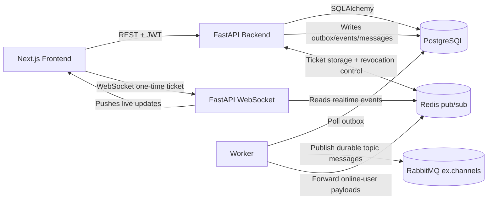

# Repository Assessment: Distributed Messaging System

Assessment of the current repository state for the graduation project:

`Building a Distributed Messaging System Based on the Publish/Subscribe Model`

This report is evidence-based and references the current codebase. Last updated after the targeted post-Phase-7 security repair on 2026-08-11.

## 1. Executive Summary

This repository is a **late-stage university MVP / demo-ready prototype**, not production-ready.

It does more than a toy chat app:
- It has real REST APIs for channels, memberships, messages, auth, events, users, uploads, and sync.
- It persists state in PostgreSQL and uses Alembic migrations.
- It has a RabbitMQ topic exchange, an outbox worker, Redis-based realtime fanout, and WebSocket delivery.
- It now has explicit outbox delivery status tracking, retry scheduling, dead-letter state, RabbitMQ DLQ topology, and a frontend Delivery Monitor.
- It now has a tamper-evident event audit hash chain with a verification API, backfill script, and frontend integrity badge/check.
- It has a substantial Next.js frontend for login, channel management, publishing, membership control, and event logs.
- It implements password hashing, JWT auth, role-based authorization, and Fernet message encryption at rest.
- It supports protected photo/video/audio attachments with server-derived attachment metadata and upload audit events.
- It now has atomic Redis counters with non-evicting fail-safe outage limiting, shared trusted client-IP semantics for HTTP and WebSocket connection controls, mandatory explicit environment selection, bounded auth/raw ordinary request bodies, bounded logical messages/protocol arrays and `/sync` materialization, established-socket frame/command/history budgets, idempotent seen/reaction changes, active-channel attachment lifecycle authorization with database-enforced message/channel consistency, streamed downloads with atomic per-user/IP/process admission, immutable existing-account invite targets plus explicit pre-registration verification state, locked targeted/reusable invite lifecycles, a documented database lock order, basic account quotas, bounded broker queues, versioned broker desired state, pre-decryption WebSocket membership generations, and paced Redis fanout retries.
- It has a separate, environment-bootstrapped global superadmin privilege with guarded global audit, account/session, channel lifecycle, and delivery controls. The console API now returns allowlisted event summaries instead of raw payloads, marks sensitive list responses non-cacheable, and supports ranked/escaped search plus server-side filters and selectable pagination. Audit rows recover channel context from safe message/outbox/upload references where the canonical event field is absent, show the unique slug alongside the channel name, link channels to their existing view route, and link actor identities to the appropriate profile page.

Biggest strengths:
- The pub/sub stack is real, not mocked.
- The domain model is broad and persistent.
- The UI covers the whole demo flow.
- There is genuine event logging and an outbox pattern.
- Delivery failures are visible through admin APIs/UI instead of only worker logs.
- Event log tampering can be detected through the hash-chain verifier when rows have initialized integrity metadata.
- Administrative intervention is auditable and does not silently grant access to private message bodies.

Biggest risks:
- Security is not strong enough for a serious deployment.
- Frontend auth tokens are browser-managed, which is acceptable for a demo but not production-grade.
- Runtime verification still depends on the full Docker stack, even though the demo verifier now exercises the live WebSocket path when available with REST backfill fallback.
- Phase 4 broker ordering/missed-Redis-removal, Phase 5 WebSocket/Redis-outage abuse, Phase 6 download concurrency, and post-Phase-7 proxy bucket isolation are deterministic application/component tests rather than live multi-worker/multi-backend/TCP load runs. Phase 7 lock concurrency uses real independent PostgreSQL sessions, but RabbitMQ failure is mocked rather than a live broker outage. Download and socket work limits remain per backend process; the Nginx path bounds one proxy instance but does not coordinate replicas or guarantee minimum client throughput. Email verification delivery is not implemented, and multi-socket presence can still mark a user offline when one of several sockets closes.
- There is no full Merkle tree, external hash anchoring, or anomaly detection feature in the codebase.
- Superadmin authentication is still password/JWT based without MFA or an external privileged-access workflow, so it remains appropriate for the university MVP rather than production operations.

Most urgent missing pieces:
- Keep the security posture honest and documented.
- Keep a small set of broker/WebSocket integration tests, including a real broker failure/DLQ scenario.
- Clarify whether the project is graded as a demo or as a security-conscious system.

## 2. Repository and Architecture Overview

### Folder Structure

- `backend/`: FastAPI backend, DB models, services, routers, migrations, and backend tests.
- `worker/`: RabbitMQ outbox publisher and online-user Redis fanout bridge.
- `frontend/`: Next.js app, UI pages, hooks, and client-side API logic.
- `docs/`: Architecture, demo, testing, and requirements mapping documentation.
- `scripts/`: Demo verification and WebSocket helper scripts.

### Main Backend Components

- [`backend/app/main.py`](backend/app/main.py)
  - Boots FastAPI.
  - Configures CORS.
  - Registers routers.
  - Declares exception handlers.
  - Installs WebSocket routes.
  - Initializes Redis, RabbitMQ, and the WebSocket manager in lifespan.
- [`backend/app/services/channel_service.py`](backend/app/services/channel_service.py)
  - Channel creation, updates, delete, membership, invites, approvals, and event retrieval.
- [`backend/app/services/message_service.py`](backend/app/services/message_service.py)
  - Publish, list, sync, seen markers, reactions, pins, uploads, and edit/delete.
- [`backend/app/services/auth_service.py`](backend/app/services/auth_service.py)
  - Register, login, refresh, logout, revoke sessions, logout all.
- [`backend/app/services/event_integrity_service.py`](backend/app/services/event_integrity_service.py)
  - Canonical event hashing, per-scope hash-chain linking, and channel integrity verification.
- [`backend/app/realtime/ws_manager.py`](backend/app/realtime/ws_manager.py)
  - WebSocket auth, subscription handling, Redis forward loop, backfill, and seen handling.
- [`backend/app/mq/publisher.py`](backend/app/mq/publisher.py)
  - Durable queue declarations and channel/user route bindings.
- [`backend/app/mq/topology.py`](backend/app/mq/topology.py)
  - RabbitMQ topic exchange declaration.
- [`backend/app/db/models.py`](backend/app/db/models.py)
  - All persistent entities.

### Frontend Components

- [`frontend/src/hooks/use-auth.ts`](frontend/src/hooks/use-auth.ts)
  - Auth lifecycle, login, register, logout, session restore.
- [`frontend/src/hooks/use-websocket.tsx`](frontend/src/hooks/use-websocket.tsx)
  - Live cache updates from WebSocket events.
- [`frontend/src/components/features/chat/pages/channel-view.tsx`](frontend/src/components/features/chat/pages/channel-view.tsx)
  - Main channel UI.
- [`frontend/src/components/features/chat/pages/channel-details.tsx`](frontend/src/components/features/chat/pages/channel-details.tsx)
  - Channel administration and event log UI.

### Database Components

PostgreSQL is the source of truth. Important entities in [`backend/app/db/models.py`](backend/app/db/models.py):
- `User`
- `UserSession`
- `Channel`
- `ChannelCounter`
- `ChannelMembership`
- `ChannelInvite`
- `Message`
- `MessageReaction`
- `PinnedMessage`
- `Upload`
- `UserChannelState`
- `Event`
- `Outbox`

### Broker / Messaging Integration

- RabbitMQ is configured as a durable topic exchange named `ex.channels`.
- Outbox rows are published by the worker to RabbitMQ.
- RabbitMQ dead-letter infrastructure is declared as `ex.channels.dlx` and `q.dead.messages`.
- Online users have durable queues bound to their username and channel routes.
- Redis is used as a live pub/sub bridge for active WebSocket sessions.

### Docker / Deployment Setup

- [`docker-compose.yml`](docker-compose.yml) defines PostgreSQL, RabbitMQ, Redis, backend, worker, and frontend.
- [`docker-compose.hardened.yml`](docker-compose.hardened.yml) provides the recommended Nginx-fronted path with only proxy port 8080 published; the direct file remains the development/demo path.
- [`backend/Dockerfile`](backend/Dockerfile) runs migrations and bootstraps the schema before launching the API.
- [`worker/Dockerfile`](worker/Dockerfile) starts the worker process.
- [`frontend/Dockerfile`](frontend/Dockerfile) builds a standalone Next.js app.

### Configuration / Environment

- [`backend/app/core/config.py`](backend/app/core/config.py) and [`worker/worker_app/core/config.py`](worker/worker_app/core/config.py) load `.env`.
- `.env.example` documents the required variables.
- A local `.env` may exist for development, but only `.env.example` is tracked in git.

### How the System Runs

- Backend:
  - Alembic migrate -> schema bootstrap -> Uvicorn.
- Worker:
  - Connect to RabbitMQ/Redis/Postgres -> poll outbox -> consume online-user queues -> forward to Redis.
- Frontend:
  - Next.js standalone build on port 3000.

### Inferred Architecture

## 3. Requirement-by-Requirement Assessment

| Requirement | Status | Evidence | Problems | Priority | Recommended Fix |
|---|---|---|---|---|---|
| 1. Topic/channel creation | Complete | [`backend/app/services/channel_service.py`](backend/app/services/channel_service.py) `ChannelService.create_channel`; [`backend/app/api/routes/channels.py`](backend/app/api/routes/channels.py) `create_channel`; [`backend/app/schemas/channels.py`](backend/app/schemas/channels.py) `ChannelCreateRequest` | Safe identifier validation exists and is backed by database constraints; docs should keep the broker-safe policy explicit | High | Keep the current safe identifier policy and document it clearly |
| 2. Publishing messages to a specific channel | Complete | [`backend/app/services/message_service.py`](backend/app/services/message_service.py) `publish_message`; [`backend/app/api/routes/messages.py`](backend/app/api/routes/messages.py) `publish_message`; outbox in [`backend/app/services/outbox_service.py`](backend/app/services/outbox_service.py) `enqueue_message_outbox`; attachment-only photo/video/audio publishing and attachment-reference validation are covered in [`backend/tests/test_p0_requirements.py`](backend/tests/test_p0_requirements.py) | Reply-only member publish path is a custom exception; broker delivery still benefits from more integration coverage | High | Add broker/WebSocket integration tests and document the reply exception clearly |
| 3. Automatic delivery to subscribers | Mostly complete | Worker Rabbit/Redis fanout; generation-aware `WSManager`; versioned `broker_binding_states`; stale-command/active-delivery Phase 4 tests; demo/approval verifiers | Desired state and final plaintext authorization are hardened, but there is still no browser e2e test or live multi-worker broker/Redis outage job | High | Keep the verifiers in the supervisor path and add a CI broker/WebSocket outage integration test later |
| 4. Channel management interface/API | Complete | [`backend/app/api/routes/channels.py`](backend/app/api/routes/channels.py) `create_channel`, `list_channels`, `get_channel`, `patch_channel`, `delete_channel`, `channel_stats` | Duplicate root routes are also exposed by [`backend/app/main.py`](backend/app/main.py) | Medium | Keep only one public API surface or document the duplicate compatibility routes |
| 5. Subscriber management interface/API | Complete | [`backend/app/api/routes/memberships.py`](backend/app/api/routes/memberships.py) `join_channel`, `leave_channel`, `list_members`, `list_pending_requests`, `create_invite`, `accept_invite`, `approve_member`, `add_member_direct`, `promote_member`, `demote_member`, `update_admin_permissions`, `remove_member`; Phase 5 covers invite races; Phase 6 binds existing email targets to immutable accounts and requires proof for unresolved targets | Email verification issuance/delivery is not implemented; non-invite flows are not all concurrency-tested | Medium | Use generic/user-ID invites in the demo and add a real verification provider only if pre-registration email delivery is required |
| 6. Authentication | Complete | [`backend/app/services/auth_service.py`](backend/app/services/auth_service.py) session-bound access checks, row-locked refresh rotation/replay detection, idle/absolute lifetime, and revocation; [`backend/app/services/ws_ticket_service.py`](backend/app/services/ws_ticket_service.py) one-time tickets; migration `0017_auth_session_hardening`; Phase 2 regressions | Frontend still uses a JS-managed access-token cookie plus `localStorage` refresh token storage, which is fine for the demo but not production-grade | High | Use httpOnly secure cookies if possible, or clearly label this as demo-only and harden XSS controls |
| 7. Authorization/permissions | Complete for university MVP | [`backend/app/services/rbac.py`](backend/app/services/rbac.py); permission checks in channel and message services; upload download route checks membership/ownership/avatar/wallpaper-reference rules before returning bytes; existing email invite targets use immutable user IDs; unresolved targets require verified email | Browser token handling, absent email delivery, and per-replica resource counters remain deployment caveats | High | Keep backend boundaries strong and document client/deployment limitations honestly |
| 8. Message encryption | Mostly complete | [`backend/app/core/encryption.py`](backend/app/core/encryption.py) `encrypt_message`, `decrypt_message`, `encrypt_json_payload`, `decrypt_json_payload`; used in message service | Dev fallback key exists; encryption key must stay out of tracked files | High | Treat encryption key as an external secret only and keep the env story explicit |
| 9. Event/activity logging | Mostly complete | [`backend/app/services/event_service.py`](backend/app/services/event_service.py) `log_event`; calls from auth/channel/message/upload services; [`backend/app/api/routes/events.py`](backend/app/api/routes/events.py) `list_channel_events`; [`backend/app/services/event_integrity_service.py`](backend/app/services/event_integrity_service.py) hash-chain verification | Event logging is not guaranteed if the logging path fails; event visibility and integrity verification are limited to channel managers | Medium | Keep the log path best-effort, document the limitation, and backfill legacy event hashes before final demos |
| 10. Distributed messaging via RabbitMQ/AMQP/etc. | Mostly complete | Bounded topology; versioned desired state/migration `0019`; worker generation check plus row lock/current DB authorization; reconnect and global repair command; demo/delivery verifiers; Delivery Monitor | Current state dominates stale commands, but asynchronous current reconciliation can remain retrying/dead-lettered during a prolonged outage and still needs a live outage test | High | Keep the verifiers and add live broker outage/recovery coverage later |
| 11. Docker/environment setup | Complete for MVP | Direct [`docker-compose.yml`](docker-compose.yml) plus Nginx-fronted [`docker-compose.hardened.yml`](docker-compose.hardened.yml); backend/worker/frontend Dockerfiles; backend startup requires an explicit `ENVIRONMENT` | Hardened path is HTTP-only and still uses demo service credentials/root-oriented images; it is scoped to P5V-02 rather than full AV-11 production hardening | Medium | Use direct Compose locally or the proxy-bounded path for recommended HTTP exposure; do not claim full production deployment |
| 12. Documentation | Mostly complete | [`README.md`](README.md); [`docs/ARCHITECTURE.md`](docs/ARCHITECTURE.md); [`docs/DEMO_GUIDE.md`](docs/DEMO_GUIDE.md); [`docs/TESTING.md`](docs/TESTING.md); [`docs/PROJECT_OVERVIEW.md`](docs/PROJECT_OVERVIEW.md); [`docs/SECURITY.md`](docs/SECURITY.md) | No final report, no screenshot pack, no polished API reference, no user manual beyond demo notes | Medium | Add a final report, screenshots, and a concise API/deployment/user manual bundle |
| 13. Testing | Mostly complete | P0 plus Phase 1–7 and post-Phase-7 security suites cover auth/session, authorization, uploads/media, identifiers, broker desired state, bounded sync/download/socket work, invite races/identity binding, trusted proxy bucket isolation, explicit environment selection, and rate-limit failure behavior; [`scripts/verify_demo_flow.py`](scripts/verify_demo_flow.py) is a manual verifier | No frontend tests, no live broker/Redis outage integration tests, and no slow-client TCP load test | High | Add one RabbitMQ/WebSocket integration test, one frontend smoke test, and controlled proxy slow-reader testing; keep the demo verifier separate |
| 14. Monitoring/message-flow visibility | Mostly complete for MVP | [`backend/app/api/routes/health.py`](backend/app/api/routes/health.py) `health`; [`backend/app/api/routes/events.py`](backend/app/api/routes/events.py) `list_channel_events`; frontend event log panel; `/v1/admin/delivery/*`; frontend Delivery Monitor | No metrics dashboard, tracing, or real broker dashboard integration; delivery monitor is scoped to managed channels | Medium | Add full-stack broker/DLQ integration tests and richer metrics only if needed |
| 15. Merkle-tree or hashing/data-integrity feature | Mostly complete for hash-chain v1 | SHA-256 event hash chain in [`backend/app/services/event_integrity_service.py`](backend/app/services/event_integrity_service.py); migration `0013_event_integrity`; endpoint `GET /v1/channels/{id}/events/integrity`; script [`scripts/backfill_event_integrity.py`](scripts/backfill_event_integrity.py); frontend Event Log integrity badge/check | No full Merkle tree, no external notarization, and legacy rows need explicit backfill | Low | Keep the hash-chain explanation honest; add optional Merkle batch roots or external anchoring only if requested |
| 16. Optional anomaly detection / AI feature | Missing | Repo-wide search found no anomaly/AI module | Not present | Low | Only add this if your supervisor explicitly expects it; otherwise do not spend time here |

## 4. Functional Flow Analysis

### Channel Creation

- Starts in [`backend/app/api/routes/channels.py`](backend/app/api/routes/channels.py) `create_channel`.
- Delegates to [`backend/app/services/channel_service.py`](backend/app/services/channel_service.py) `ChannelService.create_channel`.
- Creates the channel row, counter row, owner membership, `channel.created` event, versioned broker desired state, and a `broker_binding.reconcile` outbox snapshot.
- Commits those records together; the worker applies the current projection with normal retry/dead-letter tracking.

### Message Publish

- Starts in [`backend/app/api/routes/messages.py`](backend/app/api/routes/messages.py) `publish_message`.
- Rate-limits via Redis.
- Delegates to [`backend/app/services/message_service.py`](backend/app/services/message_service.py) `publish_message`.
- That method:
  - checks permissions,
  - encrypts content,
  - stores the message,
  - writes an outbox row,
  - logs `message.published`,
  - commits,
  - returns decrypted content to the authorized caller.

### Broker/Delivery Chain

- [`worker/worker_app/outbox_runner.py`](worker/worker_app/outbox_runner.py) reads pending outbox rows.
- It publishes persistent AMQP messages to the `ex.channels` topic exchange.
- For `broker_binding` rows it locks the desired-state pair, rejects stale generations, re-derives current authorization, and applies/removes routing keys instead of publishing an application event.
- It marks successful rows `published`, schedules retryable failures as `retry_scheduled`, and marks exhausted failures `dead_lettered`.
- Terminal dead-letter rows are also mirrored to RabbitMQ `q.dead.messages` when possible.
- [`worker/worker_app/amqp_consumer_runner.py`](worker/worker_app/amqp_consumer_runner.py) watches online users and republishes payloads to Redis pub/sub.
- [`backend/app/realtime/ws_manager.py`](backend/app/realtime/ws_manager.py) subscribes to Redis and forwards the message to the browser.

### Subscriber Registration

- Happens on:
  - channel join,
  - invite accept,
  - direct add,
  - approval,
  - initial WebSocket connect.
- Those flows update versioned desired state in PostgreSQL; the worker applies it. Initial WebSocket connect re-enqueues both desired and undesired states known for the user.

### Message Reception

- REST backfill is handled by `list_messages`, `sync`, and `mark_seen`.
- WebSocket backfill is handled by `_handle_resume`, `_send_history`, and `_handle_seen`.

### Event Logging

- Logging is done through [`backend/app/services/event_service.py`](backend/app/services/event_service.py) `log_event`.
- Exposed through [`backend/app/api/routes/events.py`](backend/app/api/routes/events.py).
- Event Integrity Upgrade v1 chains new audit events with SHA-256 through [`backend/app/services/event_integrity_service.py`](backend/app/services/event_integrity_service.py).
- Channel integrity verification is exposed through `GET /v1/channels/{id}/events/integrity` and the frontend Event Log badge/check.
- Worker-created delivery reliability events are hashed in [`worker/worker_app/outbox_runner.py`](worker/worker_app/outbox_runner.py).
- Legacy events need [`scripts/backfill_event_integrity.py`](scripts/backfill_event_integrity.py) before they verify as initialized.

### Error Handling

- Centralized error translation is in [`backend/app/core/errors.py`](backend/app/core/errors.py).
- FastAPI exception handlers are registered in [`backend/app/main.py`](backend/app/main.py).

### Where the Chain Breaks

- The system still benefits from a strict broker-safe identifier policy, even though usernames and upload paths are now sanitized.
- Broker binding application is asynchronous. PostgreSQL membership and versioned desired state are atomic, but an exhausted current reconciliation still needs operator retry, reconnect, or `python -m app.db.reconcile_broker_bindings`.
- WebSocket plaintext forwarding checks membership generations before decryption. Matching/older queued events can use the one-second default cache; newly published post-change events force immediate DB refresh.

## 5. Backend Code Quality Review

### API Design

- The REST surface is broad and reasonably clean.
- There is a clear separation between routes and services.
- One rough edge: [`backend/app/main.py`](backend/app/main.py) registers routers twice, once under `/v1` and once at the root path.

### Separation of Concerns

- Good overall:
  - routes handle transport,
  - services handle business logic,
  - models handle persistence.
- The repository layer is thin; [`backend/app/db/repository.py`](backend/app/db/repository.py) only contains `get_membership_role`.

### Error Handling

- Good centralized error handling via [`backend/app/core/errors.py`](backend/app/core/errors.py).
- Validation errors are normalized to JSON.
- Weakness: [`backend/app/services/message_service.py`](backend/app/services/message_service.py) `_safe_log_event` swallows event-logging failures, which protects the main path but hides operational problems.

### Validation

- Pydantic models are used properly in the schema layer.
- Weak spots:
  - slugs and usernames are normalized and constrained to the safe identifier pattern used by RabbitMQ and Redis routing,
  - upload filenames are normalized before storage,
  - upload content is protected by an access check on download,
  - avatar and wallpaper URLs are restricted to safe `http(s)` or protected upload-content references.

### Async Behavior

- Async DB, Redis, RabbitMQ, and WebSocket handling are consistently used.
- The WebSocket manager uses a reasonable task split between inbound and Redis-forward loops.
- The worker loops are also async and use polling plus sleep intervals.

### Broker Connection Management

- Startup is reasonably robust:
  - backend and worker retry RabbitMQ connection on startup.
- The weak point is not connection establishment but state consistency.

### Database Transactions

- Message publish is transactionally decent:
  - message row,
  - outbox row,
  - event log are written together.
- Membership changes, audit/realtime events, and broker-binding desired state are stored in one database transaction. RabbitMQ application remains asynchronous and retryable through the existing outbox.

### Secrets / Env Handling

- A real `.env` is present locally but is not tracked in git; only `.env.example` is versioned.
- Refresh tokens are stored in browser-managed localStorage; access tokens are mirrored into a JS-managed cookie.
- Access tokens are stored in JavaScript-managed cookies.
- WebSocket URLs contain only a short-lived one-time opaque ticket; raw access JWT query authentication is rejected.

### Code Duplication

- Message serialization is duplicated across backend services and WebSocket code.
- Channel/event payload shaping is repeated in a few places.
- Router registration duplication exists in [`backend/app/main.py`](backend/app/main.py).

### Naming Clarity

- Mostly good:
  - `MessageService`
  - `ChannelService`
  - `AuthService`
  - `WSManager`
  - `Outbox`

### Scalability Concerns

- Per-user queue fanout is workable for a demo or moderate load, but not ideal for large scale.
- Queue expiry, message TTL, and maximum length bound offline broker resource use; PostgreSQL/REST sync is the authoritative recovery path.
- Reaction summaries and attachment authorization no longer scale with one/two queries per message or full attachment-JSON history scans. Other broad searches still rely on rate limits and pagination rather than a measured production load design.
- The worker polls the outbox instead of using an event-driven publisher.
- Live delivery depends on Redis pub/sub and per-instance WebSocket managers. Redis auth-control messages now propagate session/user revocation across instances, but there is still no dedicated two-backend CI job.
- Socket/subscription state remains local to each backend, while realtime fanout and revocation control are shared through Redis. This is a credible MVP horizontal path but not a measured production scaling design.

## 6. Messaging-System Correctness Review

### Persistent Topics

- Effectively yes.
- Channel identities and slugs are stored in PostgreSQL.
- RabbitMQ exchange and queues are durable.

### Persistent Subscriptions

- Partly.
- Membership is persistent in PostgreSQL.
- Queue bindings are durable in RabbitMQ.
- The desired queue binding command is transactionally persisted with membership state and applied asynchronously/idempotently by the worker.

### Durable or Transient Messages

- Durable in both database and broker path.
- Message rows live in PostgreSQL.
- Outbox rows live in PostgreSQL.
- AMQP publications use persistent delivery mode.

### Queue Binding Correctness

- Mostly correct.
- The binding model is per-user and per-channel.
- Correctness depends on safe slug and username characters.

### Offline Subscribers

- Bounded durable queues can hold recent realtime events while the user is offline, subject to TTL/length/unused-queue expiry.
- PostgreSQL REST history/sync is the durable source of truth for older, expired, or evicted events.

### Broker Restart

- Durable exchange and queues help.
- Startup retries help.
- In-flight failure windows are still not fully lossless.

### Acknowledgments

- Yes.
- The worker uses AMQP publisher confirms and message processing semantics.

### Retry / Dead-Letter

- Outbox publish has retries with configurable exponential backoff.
- Retryable failures are visible as `retry_scheduled`.
- Exhausted failures become `dead_lettered` in PostgreSQL and are mirrored to RabbitMQ `q.dead.messages` when possible.
- Manual retry is exposed through scoped admin APIs and the frontend Delivery Monitor.

### Ordering

- Per-channel ordering is mostly preserved by `seq_id`.
- Global ordering across channels is not guaranteed.

### Fan-Out

- Yes, multiple subscribers can receive the same published message.

### Bottom Line

- This is a real pub/sub implementation.
- It still has routing-key design risks and DB/broker consistency risks.

## 7. Security Review

### Implemented Security

- Password hashing with Argon2 in [`backend/app/core/security.py`](backend/app/core/security.py).
- JWT access and refresh tokens in [`backend/app/core/security.py`](backend/app/core/security.py).
- Session-bound access authentication, idle/absolute lifetime, refresh-family replay detection, and durable revocation in [`backend/app/services/auth_service.py`](backend/app/services/auth_service.py).
- Short-lived hashed Redis WebSocket tickets with atomic single-use consumption in [`backend/app/services/ws_ticket_service.py`](backend/app/services/ws_ticket_service.py).
- Local and Redis-distributed socket revocation plus access-expiry closure in [`backend/app/realtime/auth_control.py`](backend/app/realtime/auth_control.py) and [`backend/app/realtime/ws_manager.py`](backend/app/realtime/ws_manager.py).
- Role/permission checks in [`backend/app/services/rbac.py`](backend/app/services/rbac.py).
- Message encryption at rest in [`backend/app/core/encryption.py`](backend/app/core/encryption.py).
- Rate limiting on auth and publish endpoints.
- Unauthorized publish/read events are logged.
- Upload downloads are authenticated and authorized; owners and members of the attached channel can access content.
- Upload creation, content storage, content access, and size/checksum store failures are logged; attachment publish requests only accept upload IDs and derive metadata server-side.
- Upload PUT bodies are streamed with bounded size/checksum validation, failure cleanup, row-locked finalization, and immutable stored bytes.
- Upload GET bodies use `FileResponse` streaming and atomic per-user/client-IP/process-global leases that release every dimension on completion/cancellation/failure; a separate Nginx path adds bounded proxy admission/timeouts.
- Existing-account email invitations resolve to immutable user IDs. Unresolved email targets require explicit verification, and profile email changes clear prior verification.
- REST `/sync` membership updates are scoped to approved channels plus self-targeted membership changes, including post-removal notification.
- REST `/sync` message queries use one decreasing global row budget and SQL `LIMIT`, with deterministic channel/sequence cursors.
- Empty WebSocket subscription sets reject ordinary channel traffic while self-targeted membership removal remains deliverable.
- Pending members are denied private read-derived state. `ENVIRONMENT` is required; only explicit dev/development/local/test labels permit development secrets, while missing/empty values and unsafe production-like JWT or encryption-key configuration fail startup.
- SVG uploads are rejected to keep protected media rendering focused on ordinary photo/video/audio content.
- Event audit rows are tamper-evident through a per-scope SHA-256 hash chain with an authorized verification endpoint.

### Weak Security

- Refresh tokens are stored in localStorage.
- Access tokens are stored in JavaScript-managed cookies.
- A real encryption key must remain outside tracked files and be provided through the environment.

### Missing / Limited Security

- No centralized secret store, KMS integration, or automated key rotation; production-like startup validation now rejects unsafe local secret configuration.
- No httpOnly cookie auth flow.
- No explicit CSRF strategy.
- No key rotation or KMS integration.
- No external notarization or off-database anchoring for event hashes.

### Recommended Minimal Security

- Keep auth working, but remove obvious holes.
- Keep upload authorization documented and covered by tests.
- Keep `.env` untracked and `.env.example` authoritative.
- Keep the safe identifier policy documented and covered by tests.
- If possible, move to httpOnly cookies for the final version.

## 8. Database and Persistence Review

### Entities

The schema in [`backend/app/db/models.py`](backend/app/db/models.py) is broad and appropriate for the project.

### Relationships

- Users own channels and sessions.
- Channels have memberships, invites, messages, events, and outbox rows.
- Messages have sender/channel FKs; reply linkage is a plain UUID field, not a FK.
- Uploads belong to users.
- Events and outbox records connect the system together.

### Migrations

- Alembic migrations are present from `0001` through `0013`, including delivery reliability and event integrity.
- Startup also has a schema repair path in [`backend/app/db/bootstrap_schema.py`](backend/app/db/bootstrap_schema.py).

### Data Survival

- Yes, via PostgreSQL volume.
- Broker state is durable as well, but PostgreSQL is the source of truth.

### Message History

- Yes, in `messages`.
- Content is encrypted before storage.

### Event Log Quality

- Events are structured and meaningful.
- They track channel creation, membership changes, message publishing, unauthorized access attempts, and broker failures.
- New events include hash-chain metadata for tamper-evident verification.

### Schema Improvements

- Add FKs for `reply_to_message_id` and possibly `last_seen_message_id`.
- Sanitize upload storage path handling.
- Make username and slug constraints broker-aware.

## 9. Frontend/UI Review

The frontend is real and fairly complete.

### Present Pages/Features

- Login/register.
- Main app shell and channel experience.
- Channel details with membership, invites, admin controls, and event log.
- Session management page.
- Invite page.
- Profile pages.

### Channel Management

- Yes: create, edit, join, leave, promote, demote, approve, invite, permission toggles.

### Subscriber Management

- Yes: members, pending requests, invites, admin permissions.

### Publishing UI

- Yes: composer, reply support, reactions, pins, mark-seen integration.

### Message Receiving UI

- Yes:
  - `use-websocket` feeds updates into React Query cache.
  - channel view renders those cached messages.

### Login/Register UI

- Yes.

### Event Log / Monitoring UI

- Yes, via the channel details page.
- Delivery reliability visibility is also available through the Delivery Monitor page for channel owners/admins.

### UX Clarity

- Better than a barebones academic app.
- It is good enough for a demo.
- It is not a mature admin console or observability dashboard.

### Missing Pages

- No full broker dashboard, though delivery status and retry controls now exist.
- No system metrics page.
- No formal ops console beyond the scoped Delivery Monitor.
- No load/diagnostics UI.

### Reliability Note

- The frontend sends explicit `subscribe` websocket envelopes after a successful join and after a targeted membership update for the current user.
- The backend allows targeted `membership_update` events through even when the affected channel is not yet in the current socket subscription set, which supports approval-required joins while the socket is already open.

## 10. Testing and Reliability Review

### Existing Tests / Tools

- Backend tests: [`backend/tests/test_p0_requirements.py`](backend/tests/test_p0_requirements.py)
- Delivery reliability tests: [`backend/tests/test_delivery_reliability.py`](backend/tests/test_delivery_reliability.py)
- Event integrity tests: [`backend/tests/test_event_integrity.py`](backend/tests/test_event_integrity.py)
- Phase 1 security regression tests: [`backend/tests/security/test_phase1_hardening.py`](backend/tests/security/test_phase1_hardening.py)
- Phase 7 security regression tests: [`backend/tests/security/test_phase7_final_app_hardening.py`](backend/tests/security/test_phase7_final_app_hardening.py)
- Demo verifier: [`scripts/verify_demo_flow.py`](scripts/verify_demo_flow.py)
- WebSocket helper: [`scripts/ws_client.py`](scripts/ws_client.py)

### What Is Missing

- No frontend test suite.
- No real broker failure/DLQ integration test suite.
- WebSocket subscription filtering has focused manager-level regressions, but there is still no automated real RabbitMQ -> Redis -> WebSocket integration suite.
- No load/stress tests.
- No CI workflow visible in the repository.

### What I Verified in This Environment

- `python -m pytest backend\tests\test_p0_requirements.py -q` passed with `33 passed, 13 skipped` during the 2026-06-16 multimedia audit.
- `npm run typecheck` in `frontend/` passed during the 2026-06-16 multimedia audit.
- `docker compose config` passed.
- `scripts/verify_demo_flow.py` and `scripts/verify_approval_flow.py` are the current supervisor-facing WebSocket verifiers; rerun them against a live Docker stack before final review.
- The new migration is `0013_event_integrity`; a live Alembic upgrade was not separately run in this pass, but `docker compose config` passed and backend tests validated the model-level schema path.
- On 2026-08-10, Phase 1 security regressions passed `27` tests, the existing upload/sync-focused group passed `29`, and the complete backend suite passed `105` tests against a dedicated PostgreSQL 16 container; `docker compose config --quiet` and `git diff --check` also passed. One existing passlib/argon2 deprecation warning remains.
- On 2026-08-10, Phase 4 P0 regressions passed `15` tests and the complete backend suite passed `158` tests against isolated PostgreSQL 16. Fresh migration through 0019 and an upgrade from 0018 with active/removed historical broker rows passed. No live multi-worker RabbitMQ ordering or Redis-loss scenario was run.
- On 2026-08-10, Phase 5 regressions passed `18` tests, Phase 1–4 security suites passed `80`, and the complete backend suite passed `176` tests against disposable PostgreSQL 16. Invite races used two independent sessions; Redis/WebSocket outage/flood behavior was deterministic rather than live multi-backend load. No migration was required.
- On 2026-08-10, Phase 6 regressions passed `19` tests, Phase 1–5 security suites passed `98`, and the complete backend suite passed `195` tests against disposable PostgreSQL 16. Fresh and representative 0019→0020 migrations passed; frontend typecheck, both Compose render checks, and containerized Nginx syntax validation passed. Email verification completion was simulated, and no live proxy slow-reader load test was run.
- On 2026-08-10, Phase 7 regressions passed `23` tests, Phase 1–6 security suites passed `117`, and the complete backend suite passed `218` tests against disposable PostgreSQL 16. Fresh and representative 0020→0021 migrations passed; one historical attachment mismatch was normalized without deleting either relation and PostgreSQL rejected a later mismatch. The historical advisory/binding cycle and channel/member serialization used independent real PostgreSQL sessions; RabbitMQ failure was mocked. Frontend typecheck and both Compose render checks passed.

### Practical Testing Plan

- Keep the current backend P0, delivery reliability, and event integrity tests.
- Add one RabbitMQ/WebSocket integration test.
- Keep the upload authorization regression coverage in the backend tests.
- Add one frontend smoke test for login -> create channel -> publish -> see event log.
- Keep the demo verifier script as the supervisor-facing manual check.

## 11. Deployment and Running Instructions Review

### What Is Good

- Docker Compose defines all required services.
- Backend Dockerfile runs migrations before app startup.
- Frontend Dockerfile builds a standalone app.
- README and demo guide explain the run flow.

### What Is Missing / Risky

- The stack depends on PostgreSQL, RabbitMQ, and Redis all being healthy before backend startup.
- Docs mention a Windows frontend build caveat.
- The demo flow is verified here, but it still depends on the live Docker stack.

### Common Failure Points

- Missing `MESSAGE_ENCRYPTION_KEY`.
- RabbitMQ not ready when backend starts.
- PostgreSQL not ready when migrations run.
- Windows build differences.
- Secrets accidentally changed in `.env`.

## 12. Documentation Gap Analysis

### Already Good

- `README.md`
- `docs/ARCHITECTURE.md`
- `docs/PROJECT_OVERVIEW.md`
- `docs/DEMO_GUIDE.md`
- `docs/TESTING.md`
- `docs/REQUIREMENTS_MAPPING.md`
- `docs/SECURITY.md`
- `docs/FINAL_MVP_STATUS.md`
- `docs/FINAL_DEMO_CHECKLIST.md`

### Still Missing for Final Submission

- Final report document if required by the university.
- User manual polished beyond the demo guide.
- Screenshot pack.
- API reference or exported OpenAPI guide in a nicer format.
- Deployment guide for a fresh evaluator machine.
- English/Arabic submission report if required by the department.

### Important Note

- `docs/REQUIREMENTS_MAPPING.md` is still a bit optimistic in the testing column, but the high-level MVP claims are now much closer to the code than they were in the original draft.

## 13. Final Project Readiness Score

| Category | Score | Why |
|---|---:|---|
| Core pub/sub functionality | 78 | Real broker, outbox, durable queues, websocket fanout, and REST backfill all exist |
| Architecture | 72 | Clear service separation and realistic distributed components, but some consistency and routing risks remain |
| Backend quality | 68 | Solid domain logic and validation, but large services, a thin repo layer, and a few risky shortcuts |
| Frontend/UI | 82 | Surprisingly complete for a graduation project, with actual channel, membership, publishing, and event-log flows |
| Security | 78 | Session-bound auth, replay detection, one-time WebSocket tickets, distributed revocation, bounded established-socket work, atomic/fail-safe rate limiting, immutable invite identity binding, layered protected-download admission, encryption, and lifecycle-aware uploads exist; browser credentials, email delivery, and full production posture remain demo-grade |
| Persistence/database | 84 | Strong schema coverage and durable storage, with only a few schema-quality improvements needed |
| Testing | 55 | Backend regression tests exist and pass here, but frontend/broker integration coverage is still thin |
| Deployment | 76 | Dockerized with direct and proxy-bounded paths, but TLS, managed secrets, least privilege, and multi-replica policy remain future work |
| Documentation | 68 | Good docs set overall, but still missing final-report polish and deliverable packaging |
| Overall graduation-project readiness | 73 | Functionally strong, with the main remaining gap being test depth and demo-grade auth storage |

## 14. Final MVP Status

### Complete

- Authentication, password hashing, session-bound access, refresh replay detection, absolute lifetime, one-time WebSocket tickets, distributed revocation, membership controls, channel CRUD, message persistence, event logging, upload/avatar/wallpaper authorization, safe identifier validation, and server-side encryption at rest.

### Mostly Complete

- Distributed publish/subscribe delivery through PostgreSQL outbox, RabbitMQ, worker dispatch, Redis fanout, and WebSocket push.
- The repo now has a stronger proof script that exercises live WebSocket delivery when available and REST backfill fallback, and it passed in this workspace, but there is still no dedicated CI job for the full stack.

### Demo-Grade

- Frontend token handling. Access tokens are mirrored into a JavaScript-managed cookie and refresh tokens live in `localStorage`, which is acceptable for a university demo but not production-grade session security.

### Future Work

- Frontend smoke tests, broader broker/WebSocket integration coverage, a production-grade session strategy, and any advanced non-MVP features.

## 15. Priority Roadmap

### Must Finish First

| Task | Why it matters | Difficulty | Files/modules likely involved | Suggested direction |
|---|---|---:|---|---|
| Add a stronger broker/WebSocket integration test | The project's main selling point still deserves direct proof | Medium | [`backend/tests/`](backend/tests), [`scripts/verify_demo_flow.py`](scripts/verify_demo_flow.py), [`scripts/verify_approval_flow.py`](scripts/verify_approval_flow.py) | Keep the supervisor verifiers and add at least one CI RabbitMQ/WebSocket integration test later |
| Keep safe identifier policy documented and covered by tests | Routing-key safety is already implemented, but it still needs to stay explicit and regression-tested | Low | [`backend/app/schemas/channels.py`](backend/app/schemas/channels.py), [`backend/app/schemas/auth.py`](backend/app/schemas/auth.py), [`backend/tests/test_p0_requirements.py`](backend/tests/test_p0_requirements.py) | Keep the safe identifier policy documented and covered by the existing validation tests |
| Keep browser-side token storage clearly labeled as demo-grade | Prevents overclaiming security | Medium | frontend auth hooks/store/docs | If you cannot move to httpOnly cookies, clearly mark it as demo-only and harden UI inputs/SOP |

### Should Finish Next

| Task | Why it matters | Difficulty | Files/modules likely involved | Suggested direction |
|---|---|---:|---|---|
| Resubscribe sockets when membership changes | Prevents live-delivery gaps after join/accept | Medium | [`backend/app/realtime/ws_manager.py`](backend/app/realtime/ws_manager.py), [`frontend/src/hooks/use-websocket.tsx`](frontend/src/hooks/use-websocket.tsx) | Emit membership-change websocket updates that refresh subscription state on the active socket |
| Add frontend smoke coverage | The UI is a big part of the demo | Medium | `frontend/src/components/features/chat/pages/*`, `package.json` | Add a minimal test stack or scripted browser smoke test for login and channel flow |
| Polish documentation into a submission pack | Supervisors grade what they can read and show | Low | [`README.md`](README.md), `docs/` | Add final report, screenshots, and a concise deployment/user manual |
| Improve schema constraints | Cuts future bugs and hardens persistence | Medium | [`backend/app/db/models.py`](backend/app/db/models.py), Alembic versions | Add missing FKs/constraints where practical, especially reply links and upload path safety |

### Nice to Have

| Task | Why it matters | Difficulty | Files/modules likely involved | Suggested direction |
|---|---|---:|---|---|
| Expand the Delivery Monitor into richer ops metrics | Makes the system more teachable if extra polish is needed | Medium | Frontend delivery page, events API, health route | Add broker health, event counts, online users, recent publishes, and live refresh |
| Add optional Merkle batch roots or external hash anchoring | Helps the cryptography angle beyond hash-chain v1 | High | Event integrity service, docs, possibly a new anchoring table | Keep v1 stable first; only add Merkle roots or off-database anchoring if the supervisor asks |
| Add anomaly detection / AI message analysis | Nice advanced feature if your supervisor wants a stretch goal | High | New worker/service + analytics UI | Keep it lightweight: frequency spikes, unread surges, or simple anomaly scoring |
| Add load/reliability tests | Useful for defending the design in a presentation | Medium | `scripts/`, backend integration tests | Script a small multi-user publish flood and measure latency/throughput |

## 16. Questions for the Student

1. Should offline subscribers be guaranteed to receive missed messages later, or is live-only delivery acceptable?
2. What maximum media file size should be used in the final demo beyond the current 25 MB backend default?
3. Does your supervisor expect production-grade security, or is a demo-grade auth setup enough?
4. Is a web UI required for submission, or would an API plus demo script be acceptable?
5. Should channel slugs and usernames be strictly limited to broker-safe characters now, even if that changes the current naming style?
6. Do you want the final submission to emphasize RabbitMQ semantics, or the application UI and security story?

## 17. Final Honest Verdict

### Is the project currently acceptable for minimum submission?

- Functionally, probably yes for a university demo, because the core publish/subscribe, auth, permissions, event logging, persistence, and UI flows are present.
- As a secure or polished system, not fully. Browser token handling and the still-thin integration test story are the main remaining concerns.

### What would make it acceptable?

- Keep the backend authorization story well documented.
- Keep secrets out of tracked files.
- Keep the safe identifier policy documented for RabbitMQ and Redis naming.
- Show at least one working end-to-end demo path and one verified test run.

### What would make it impressive?

- Add broker/WebSocket integration tests.
- Keep the approval-required WebSocket verifier in the final demo path.
- Expand the Delivery Monitor with richer operational metrics if time allows.
- Ship a cleaned-up final report with screenshots and a clear deployment story.

### Top 5 Concrete Next Actions

1. Add one real integration test for outbox -> RabbitMQ -> Redis -> WebSocket delivery.
2. Keep browser-stored tokens clearly labeled as demo-grade in the documentation.
3. Produce the final report package: README cleanup, screenshots, demo script, and a short architecture/security explanation.
4. Keep the safe identifier policy documented for routing keys and Redis channels.
5. If time allows, add a small frontend smoke test for the main channel flow.
