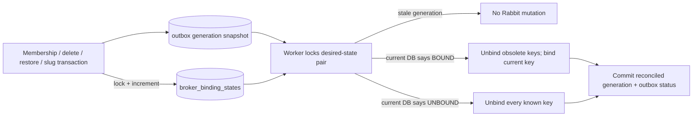

# Security Hardening Phase 4 Report

## 1. Scope

Phase 4 addressed only the three High findings from `SECURITY_VERIFICATION_AFTER_PHASE3.md`: stale broker/WebSocket authorization (AV-01), unbounded `/sync` message work (AV-02), and full-file download buffering (AV-03). The existing PostgreSQL → outbox → RabbitMQ → Redis → WebSocket architecture and public HTTP contracts were preserved. AV-08 slug/restore paths were changed only because they mutate the same topology governed by the AV-01 invariant.

## 2. Verification findings addressed

| Finding | Confirmation | Result |
| --- | --- | --- |
| AV-01 | **CONFIRMED** | Fixed with versioned PostgreSQL desired state, worker serialization/current-state checks, two-way reconciliation, and generation-aware authorization before WebSocket decryption. |
| AV-02 | **CONFIRMED** | Fixed with a decreasing global page budget and SQL `LIMIT remaining` on every selected-channel message query. |
| AV-03 | **CONFIRMED** | Fixed with `FileResponse` streaming plus a race-safe per-user/per-process concurrency lease. |

## 3. AV-01 broker authorization architecture

### Root cause and model

Phase 3 outbox rows stored historical `bind`/`unbind` actions. Opposite actions are not commutative, so retry eligibility and `SKIP LOCKED` could make an older action execute last.

Migration `0019_phase4_p0_hardening` adds `broker_binding_states(channel_id, user_id)` with:

- monotonically increasing `generation`;
- `desired_bound`;
- current `desired_routing_key`;
- all not-yet-reconciled `routing_keys` (including old slugs);
- `reconciled_generation`.

Outbox rows now contain only a pair identity and generation (`broker_binding.reconcile`). The worker never trusts a payload action, username, slug, or desired boolean.



### Transaction and ordering rules

- Membership/read-access transitions increment `channels.membership_generation` and update the pair's broker generation in the same transaction as membership, audit, and outbox rows.
- Channel delete/restore and slug update use the same desired-state helper. The previous direct post-commit Rabbit calls are no longer executed.
- The worker locks `broker_binding_states` with `FOR UPDATE`, compares the command generation, then re-derives authorization from the current membership role and active-channel state before RabbitMQ access.
- Application topology mutations lock the same state row. A mutation racing a worker either commits first (the worker sees/rejects the old generation) or waits until the old projection completes and then commits a newer projection.
- Multiple workers processing reordered outbox rows serialize on the pair state. `SKIP LOCKED` can change command order but cannot change the final desired state.
- Duplicate current-generation execution repeats idempotent full bind/unbind projection.
- If Rabbit succeeds and the worker crashes before PostgreSQL/outbox acknowledgement, the transaction rolls back and retry repeats the full projection. Obsolete keys are pruned from PostgreSQL only after Rabbit operations and the DB update commit together.
- Pre-Phase-4 action rows have no generation and are acknowledged as superseded. Migration 0019 creates one current snapshot for every known pair.

### WebSocket final-delivery authorization

Every new channel/message outbox payload carries the channel's serialized `membership_generation`. WebSocket connections cache authorized channel generations. A newer event generation or a legacy event with no generation causes a PostgreSQL membership/channel check before message decryption. Removed users are unsubscribed and the ciphertext is not decrypted or sent.

Matching/older generations may use the deliberately short `WS_MEMBERSHIP_AUTH_CACHE_TTL_SECONDS` window (default one second). Therefore a newly published post-removal event forces immediate revalidation; an older already-queued event has a documented maximum one-second cache window by default.

### Reconciliation

- WebSocket reconnect enqueues every known pair for that user, including `desired_bound=false` rows, so it repairs missing bindings and removes stale undesired bindings.
- `python -m app.db.reconcile_broker_bindings` enqueues the complete PostgreSQL-derived projection for operator repair.
- Slug reconciliation retains old/current keys until successful Rabbit application, then prunes to the current key.

## 4. AV-02 bounded sync architecture

`MessageService.sync` retains the existing deterministic order: selected channel UUID ascending, then `seq_id` ascending (with message ID as a stable tie-breaker). It initializes `remaining=req.limit`; every channel query uses `.limit(remaining)`, appends only that page, decrements the budget, and stops at zero.

Consequences:

- maximum message queries: 100 (the existing protocol channel bound), usually fewer once the page fills;
- maximum `Message` rows materialized/decrypted/rendered: `req.limit` (maximum 500);
- no Python full-history sort;
- existing per-channel sequence cursors remain compatible and do not skip later channels/messages;
- requested cursor IDs are still intersected with current approved memberships before any message query.

The API does not add a new global cursor. A channel with enough history can fill a page before later UUID-sorted channels, matching the prior observable sort/slice order; callers advance the returned per-channel sequence cursor and repeat.

## 5. AV-03 streaming download architecture

The protected GET route performs authentication, upload lookup, containment validation, authorization, and audit work first. It then explicitly closes the database session and returns `LeasedFileResponse`, a Starlette `FileResponse` subclass. Starlette opens/reads the local file asynchronously in bounded chunks and awaits ASGI sends, providing socket backpressure and useful file headers without `Path.read_bytes()`.

`DownloadConcurrencyLimiter` atomically admits at most `MAX_CONCURRENT_DOWNLOADS_PER_USER` active streams per user in one backend process (default 3). `LeasedFileResponse.__call__` releases the lease in `finally`, covering normal completion, client cancellation, and send failure. A failure before response handoff also releases the lease. No database transaction is held during the file transfer.

## 6. Database migrations

`backend/alembic/versions/0019_phase4_p0_hardening.py`:

- adds `channels.membership_generation bigint NOT NULL DEFAULT 1`;
- creates `broker_binding_states` and indexes;
- backfills pairs from current memberships **and** historical broker-binding outbox rows;
- derives `desired_bound` from current active membership/channel state;
- retains current and historical safe routing keys for stale cleanup;
- enqueues one current reconcile row per state.

Fresh upgrade through 0019 passed. An upgrade from 0018 with one active member and one removed user represented only by old bind rows produced `desired_bound=true/false`, retained `channel.new-slug` and `channel.old-slug`, and inserted two current reconcile rows.

## 7. Tests added

Exact focused tests in `backend/tests/security/test_phase4_p0_hardening.py`:

- `test_old_bind_generation_cannot_beat_newer_unbind`
- `test_old_unbind_generation_cannot_beat_newer_rejoin`
- `test_duplicate_current_generation_is_idempotent`
- `test_worker_crash_after_rabbit_action_retries_full_projection_safely`
- `test_missed_membership_event_cannot_deliver_or_decrypt_post_removal_message`
- `test_active_member_refreshes_generation_and_receives_realtime_message`
- `test_slug_delete_and_restore_use_same_versioned_reconciliation`
- `test_sync_large_single_channel_materializes_only_global_limit`
- `test_sync_many_channels_uses_one_decreasing_global_row_budget`
- `test_sync_next_cursor_has_no_skip_or_duplicate`
- `test_sync_arbitrary_pending_removed_and_outsider_cursors_return_no_history`
- `test_protected_download_uses_chunked_file_response_without_read_bytes`
- `test_protected_download_authorization_blocks_pending_removed_and_outsider_before_stream`
- `test_download_concurrency_limit_allows_boundary_and_rejects_one_above`
- `test_aborted_stream_releases_download_slot`

Existing Phase 1 WebSocket and P0 download assertions were updated to exercise the new generation cache/ASGI streaming response. Phase 3 binding tests now assert desired state and generation snapshots rather than historical action names.

## 8. Adversarial scenarios

- **Attack A — stale bind:** newer unbind applied; delayed old bind returned `stale_generation`; final channel binding set remained empty.
- **Attack B — stale socket:** membership removed in PostgreSQL; no membership event delivered to the simulated socket; a newer-generation message was rejected before the decryption function ran.
- **Attack C — huge sync history:** 10,000 missed rows with `limit=100` returned/materialized 100. The 100-channel case shared one 500-row budget, preserved deterministic order, and did not use `100 × limit` materialization.
- **Attack D — download memory exhaustion:** a 300,000-byte file was sent as multiple chunks with `Path.read_bytes` replaced by a failing sentinel; the configured concurrency boundary rejected one above the limit and cancellation released the slot.

## 9. Performance/query evidence

- Single-channel instrumentation recorded one helper call `(requested SQL limit=100, materialized rows=100)` over 10,000 stored messages.
- The 100-channel regression deterministically asserted that all page helper materializations summed to exactly 500 and that each next query limit equaled the prior remaining budget. Production has at most 100 such message queries and never materializes more than the global response limit.
- The download regression observed multiple non-empty ASGI body frames, each no larger than `FileResponse.chunk_size`; a patched `Path.read_bytes` would fail the test if full buffering returned.
- Broker regressions assert the worker result `stale_generation` and unchanged effective channel-binding sets after delayed opposite commands.

These are deterministic query/behavior bounds, not wall-clock benchmark claims.

## 10. Validation results

All database validation used disposable PostgreSQL 16 container `messaging-phase4-security-postgres` on loopback port 55440.

```text
python -B -m pytest -q tests/security/test_phase4_p0_hardening.py
15 passed, 1 warning in 17.92s

python -B -m pytest -q tests/security/test_phase1_hardening.py tests/security/test_phase2_auth_hardening.py tests/security/test_phase3_abuse_hardening.py tests/security/test_phase4_p0_hardening.py
80 passed, 1 warning in 45.45s

python -B -m pytest -q
158 passed, 1 warning in 89.79s

python -B -m alembic upgrade head
passed on a fresh database; current revision 0019_phase4_p0_hardening

upgrade 0018 -> head with representative active/removed binding rows
passed; 2 desired-state rows and 2 reconcile outbox rows

docker compose config --quiet
passed

git diff --check
passed; Git emitted line-ending conversion notices only
```

The warning is the existing passlib access to deprecated `argon2.__version__` metadata. Frontend checks were not run because no frontend files changed.

## 11. Remaining limitations

- No live multi-worker RabbitMQ ordering/outage test was run; broker behavior was simulated deterministically.
- The missed Redis membership event was simulated, not induced against a live Redis/backend pair.
- Matching/older already-queued events have the configurable one-second default WebSocket membership-cache window. New post-change events force immediate refresh.
- A current reconcile row can still reach dead-letter status after repeated Rabbit failure; reconnect, scoped manual retry, or the global reconciliation command can re-enqueue desired state.
- Legacy Rabbit bindings with neither a current membership nor historical outbox evidence cannot be discovered through normal AMQP APIs. The documented one-time legacy queue recreation/reset remains necessary.
- Download concurrency is per backend process, not globally distributed. Reverse-proxy bandwidth, connection, IP, and slow-client limits remain external production requirements.
- No production-readiness claim is made.

## 12. Remaining verification findings

- **AV-04 (Medium):** established WebSocket command throttling/work budgets remain open.
- **AV-05 (Medium):** deleted-channel attachment lifecycle remains open.
- **AV-06 (Medium):** invite accept/revoke race and generic-invite semantics remain open.
- **AV-07 (Medium):** emergency limiter LRU-eviction bypass and non-atomic Redis counter expiry remain open.
- **AV-08 (Medium):** slug update and restore now structurally use the Phase 4 desired-state mechanism as required by AV-01; live Rabbit-failure verification for those paths remains absent, so this report does not independently reclassify the audit finding.
- **AV-09 (Low):** relational attachment/message/channel constraint remains open.
- **AV-10 (Low):** unknown production environment labels still fail open.
- **AV-11 (Low):** production deployment posture remains open.

## 13. Recommended Phase 5

1. Add WebSocket command rate/work budgets and inbound/outstanding-work backpressure (AV-04).
2. Define and enforce attachment access across channel delete/restore (AV-05).
3. Make invite acceptance/revocation a locked or conditional atomic transition after defining generic-link semantics (AV-06).
4. Make emergency Redis-outage limiting saturation fail safe and make counter+expiry atomic (AV-07).
5. Add a live two-worker RabbitMQ/Redis outage-ordering integration scenario, including slug/restore recovery.
6. Then address AV-09 through AV-11 without expanding the pub/sub MVP.

## 14. Files changed

- Configuration/docs: `.env.example`, `README.md`, `REPOSITORY_ASSESSMENT.md`, `docs/ARCHITECTURE.md`, `docs/FINAL_MVP_STATUS.md`, `docs/REQUIREMENTS_MAPPING.md`, `docs/SECURITY.md`, `docs/STABILIZATION_STATUS.md`, `docs/TESTING.md`.
- Migration/model: `backend/alembic/versions/0019_phase4_p0_hardening.py`, `backend/app/db/models.py`.
- Broker desired state/reconciliation: `backend/app/services/outbox_service.py`, `backend/app/db/reconcile_broker_bindings.py`, `backend/app/services/channel_service.py`, `backend/app/services/admin_service.py`, `worker/worker_app/outbox_runner.py`.
- WebSocket final authorization: `backend/app/realtime/ws_manager.py`, `backend/app/core/config.py`.
- Bounded sync: `backend/app/services/message_service.py`.
- Streaming downloads: `backend/app/api/routes/messages.py`, `backend/app/services/download_service.py`.
- Tests: `backend/tests/conftest.py`, `backend/tests/security/test_phase1_hardening.py`, `backend/tests/security/test_phase3_abuse_hardening.py`, `backend/tests/security/test_phase4_p0_hardening.py`, `backend/tests/test_p0_requirements.py`.
- Report: `SECURITY_HARDENING_PHASE4_REPORT.md`.
