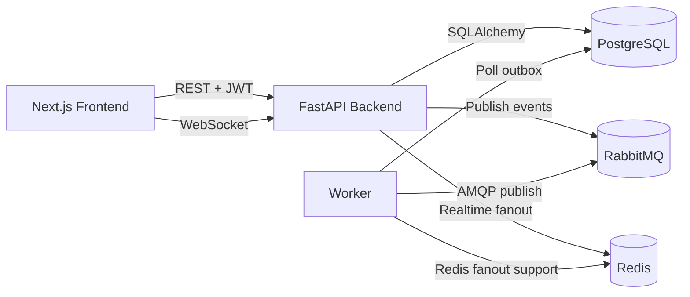
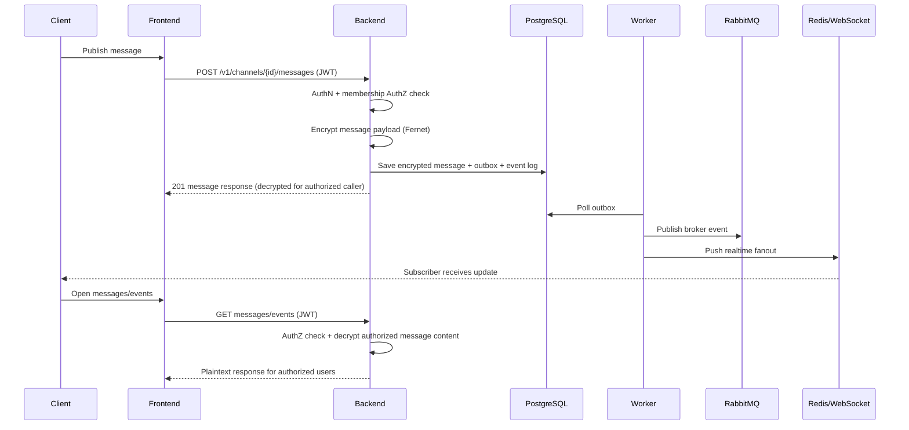

# Architecture

## Component Responsibilities
- Backend (FastAPI)
  - Exposes REST + WebSocket endpoints.
  - Enforces authentication/authorization.
  - Encrypts/decrypts message content.
  - Persists domain data and emits outbox/event entries.
- Worker
  - Polls outbox entries.
  - Publishes routing events to RabbitMQ.
  - Supports realtime fanout integration.
- RabbitMQ
  - Broker for publish/subscribe routing across services.
- Redis + WebSocket
  - Low-latency delivery path for active subscribers.
- PostgreSQL
  - Source of truth for users, channels, memberships, messages, outbox, and events.
- Frontend (Next.js)
  - User workflows: auth, channels, join/leave, publish/read, event logs.

## High-Level Architecture

## Message Lifecycle

## Event Logging Points
- `channel.created`
- `membership.*` events
- `message.published`
- `security.unauthorized_publish`
- `security.unauthorized_read`

Events are stored in `events` table and shown in frontend channel details.
