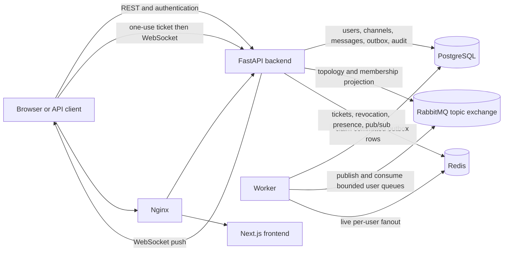

# Architecture

## System context

The system is a distributed publish/subscribe application. A channel is the application-level topic. PostgreSQL owns durable state; RabbitMQ and Redis move committed events toward online subscribers; REST remains the recovery path when realtime delivery is missed.



## Component responsibilities

| Component | Responsibility |
|---|---|
| `backend/` | FastAPI routes, authentication, authorization, validation, business services, encryption/decryption, persistence orchestration, WebSockets, audit/Merkle APIs, and operator CLIs. |
| `worker/` | Poll committed outbox rows, publish persistent AMQP messages, project membership bindings, consume queues for online users, retry/dead-letter failures, and fan out through Redis. |
| `frontend/` | Next.js UI for authentication, channels, membership, publishing, protected media, event logs, delivery monitoring, presence, and superadmin operations. |
| PostgreSQL | Durable source of truth for users, sessions, channels, memberships, messages, uploads, outbox, events, desired broker bindings, and Merkle checkpoints/leaves. |
| RabbitMQ | Topic exchange, bounded durable per-user queues, membership bindings, publisher confirms, acknowledgements, and diagnostic dead-letter exchange/queue. |
| Redis | Ephemeral live fanout, WebSocket tickets/control, distributed rate limits, presence leases, and online-user coordination. |
| Nginx | Hardened HTTP boundary and production TLS termination, request/connection bounds, security headers, trusted forwarding identity, and WebSocket proxying. |

## Repository structure

```text
backend/                 FastAPI application, Alembic migrations, tests, operator tools
frontend/                Next.js application and locked npm dependencies
worker/                  Outbox/RabbitMQ/Redis worker
scripts/                 Demo, migration, reliability, and release verifiers
deploy/                  Nginx and PostgreSQL initialization configuration
docs/                    Current authoritative documentation
reports/security/        Historical hardening and verification reports
docker-compose*.yml      Development, hardened-demo, and production-oriented profiles
```

## Message publication flow

```text
Client
  -> FastAPI authentication and channel authorization
  -> payload validation
  -> server-side encryption
  -> one PostgreSQL transaction: message + outbox + audit event
  -> worker claims the committed outbox row
  -> RabbitMQ topic exchange and subscriber queue bindings
  -> worker consumes an online subscriber queue
  -> Redis per-user pub/sub
  -> authorized backend WebSocket
  -> subscriber UI
```

Publisher confirms and explicit outbox states record success, scheduled retry, and terminal dead-letter status. The database outbox is authoritative; the RabbitMQ dead-letter queue is an operational mirror when RabbitMQ is available.

## Subscription and routing flow

Membership changes are committed in PostgreSQL with a versioned desired broker-binding state and an outbox snapshot. The worker locks and re-derives current authorization before applying bindings, ignores stale generations, removes obsolete channel-slug routing keys, and records the reconciled generation. Usernames and channel slugs must match `^[A-Za-z0-9_-]{3,50}$` before they can reach queue, routing-key, or Redis-channel construction.

RabbitMQ uses the durable topic exchange `ex.channels`. User queues are named from validated usernames and are bounded by expiry, message TTL, and maximum length. On worker startup, current database users whose retained queues predate those managed arguments are migrated one queue at a time; only the recognized missing-argument shape is eligible, active consumers block deletion, and PostgreSQL sync recovers any queue-only realtime copies. Unrelated topology mismatches remain errors for operator review. A channel publish uses a validated `channel.<slug>` routing key. PostgreSQL membership is still checked before protected REST or WebSocket delivery.

## Offline recovery and ordering

WebSocket delivery is a live optimization, not the durable record. RabbitMQ queues are intentionally bounded and Redis pub/sub is ephemeral. An offline or reconnecting subscriber retrieves history and `/sync` data from PostgreSQL.

Ordering is stable per channel through channel sequence values. The system does not promise one global order across different channels. Outbox delivery is at-least-once in failure/retry windows; consumers and projections are designed to tolerate idempotent repeats.

## Attachment flow

```text
Client creates upload metadata
  -> backend authorizes and validates filename/MIME/size
  -> upload body is streamed and checksummed
  -> chunks are encrypted into authenticated AES-256-GCM storage
  -> finalized upload metadata is linked to a message
  -> authorized download checks membership/lifecycle
  -> bounded streaming authenticated decrypt
  -> client receives original bytes
```

Finalized files live under the configured `UPLOADS_BASE_DIR` (`/data/uploads` in Compose) on the upload volume. Database records store logical metadata and the relative storage path; API responses do not expose private host paths. Encrypted range requests are rejected because authenticated framing must be verified in order.

## Identity and presence flow

```text
register
  -> login creates a server-side session
  -> request email-verification challenge
  -> deliver fragment URL through console/capture/SMTP
  -> authenticated user confirms the exact current email snapshot
  -> unresolved pre-registration email invite may be accepted
```

An invitation for an already existing user is bound to immutable `user_id`. An unresolved pre-registration email invitation becomes usable only after the eventual account verifies ownership of the normalized target email. Changing the account email clears prior verification and revokes outstanding challenges.

Each admitted WebSocket owns a Redis presence lease. Aggregate online/offline transitions account for multiple tabs, sessions, and backend instances. Presence is presentation metadata and never grants authorization.

## Audit and Merkle flow

```text
Application action
  -> audit event
  -> canonical SHA-256 event hash
  -> ordered channel/system hash chain
  -> periodic bounded Merkle checkpoint batch
  -> Merkle root
  -> canonical checkpoint hash and previous-checkpoint link
  -> Ed25519 signature
  -> compact proof and optional external anchor
```

A normal event write updates only its scope hash chain; it does not synchronously rebuild a Merkle tree. Events accumulate until an operator or external scheduler runs a bounded checkpoint job. Production may schedule that one-shot command with cron, a systemd timer, or a deployment scheduler without adding a scheduler service to the application.

Why all four integrity layers exist:

- The event hash detects payload/metadata changes.
- The per-scope hash chain proves ordered continuity inside a channel or the system audit scope.
- The Merkle tree proves batch membership with `O(log n)` sibling hashes.
- The Ed25519-signed linked checkpoint resists database-only root replacement. Independently retaining an exported latest anchor adds rollback/tail-deletion evidence.

This is tamper evidence under the documented key and anchor assumptions, not immutable storage or a blockchain.

## Deployment boundaries

- `docker-compose.yml`: development convenience; direct host ports, HTTP, development credentials, automatic migrations, and optional idempotent superadmin bootstrap.
- `docker-compose.hardened.yml`: local/demo HTTP through Nginx on port 8080; state services and applications stay on a private Compose network.
- `docker-compose.production.yml`: single-host production-oriented reference; TLS Nginx edge, authenticated private state services, one-shot migration/grant service, non-superuser runtime database role, non-root read-only application containers, explicit bootstrap profile, and isolated Merkle signing profile.

See [Development](DEVELOPMENT.md) and [Deployment](DEPLOYMENT.md) for exact commands.

## Major dependencies

The tables list important direct dependencies, not every transitive package.

| Backend/worker dependency | Purpose |
|---|---|
| FastAPI and Uvicorn | HTTP/WebSocket application and ASGI server. |
| SQLAlchemy asyncio and asyncpg | Async persistence against PostgreSQL. |
| Alembic | Ordered schema migrations. |
| Pydantic and pydantic-settings | Request/configuration validation. |
| aio-pika | RabbitMQ topology, publish confirms, queues, bindings, and acknowledgements. |
| redis | Redis pub/sub, tickets, presence, revocation, and rate-limit coordination. |
| cryptography | Message/upload encryption, HKDF/AES-GCM/Fernet compatibility, and Ed25519 signatures. |
| Argon2/passlib | Password hashing and compatibility handling. |
| python-jose | JWT signing and verification. |
| httpx, pytest, pytest-asyncio | API integration and regression testing. |

| Frontend dependency | Purpose |
|---|---|
| Next.js and React | Application framework and UI rendering. |
| next-intl | English/Arabic routing and translations. |
| TanStack Query | Server-state fetching, caching, and invalidation. |
| Zustand | In-memory authentication and chat preference state. |
| Radix UI primitives | Accessible dialogs, menus, forms, tabs, and related controls used by the UI. |
| Tailwind CSS | Styling pipeline. |
| Framer Motion | Focused UI motion. |

| Infrastructure | Purpose |
|---|---|
| PostgreSQL 16 | Durable relational state and transactional coordination. |
| RabbitMQ 3.13 | AMQP topic routing and bounded durable queues. |
| Redis 7 | Ephemeral distributed coordination and live fanout. |
| Nginx 1.27 | Hardened reverse proxy/TLS boundary. |

`pyproject.toml`/`package.json` are the direct dependency sources. `requirements.lock` and `package-lock.json` are the validated reproducible installation inputs used by Docker and `npm ci`.

## Database evolution

Alembic has one current head: `0024_phase11_merkle_audit`. Development Compose upgrades automatically. Production Compose runs migrations and runtime-role grants in the one-shot `migrate` service before the API/worker starts. Schema migration creates Merkle tables but does not create historical checkpoints; event-chain backfill and Merkle checkpointing are explicit operator actions.
