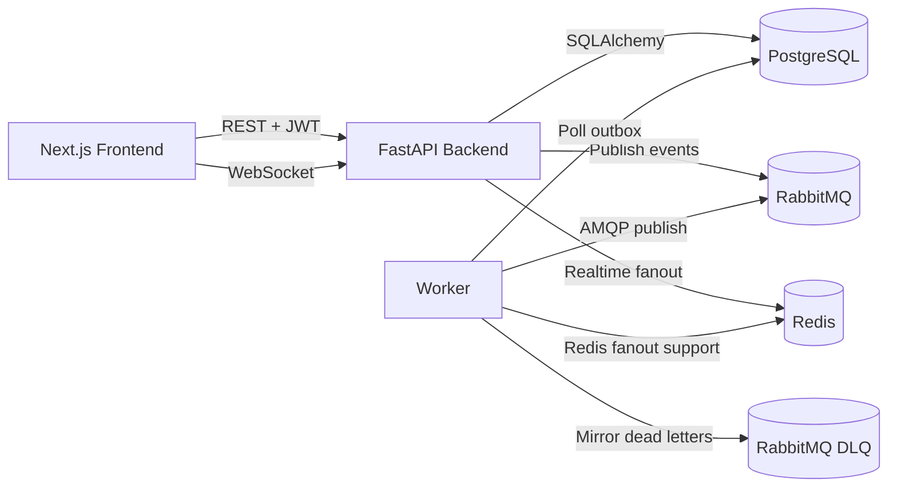
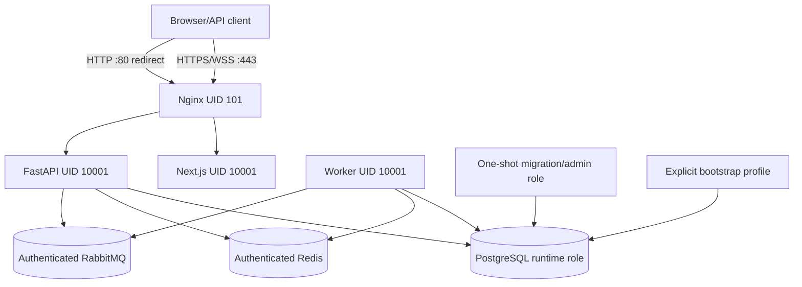
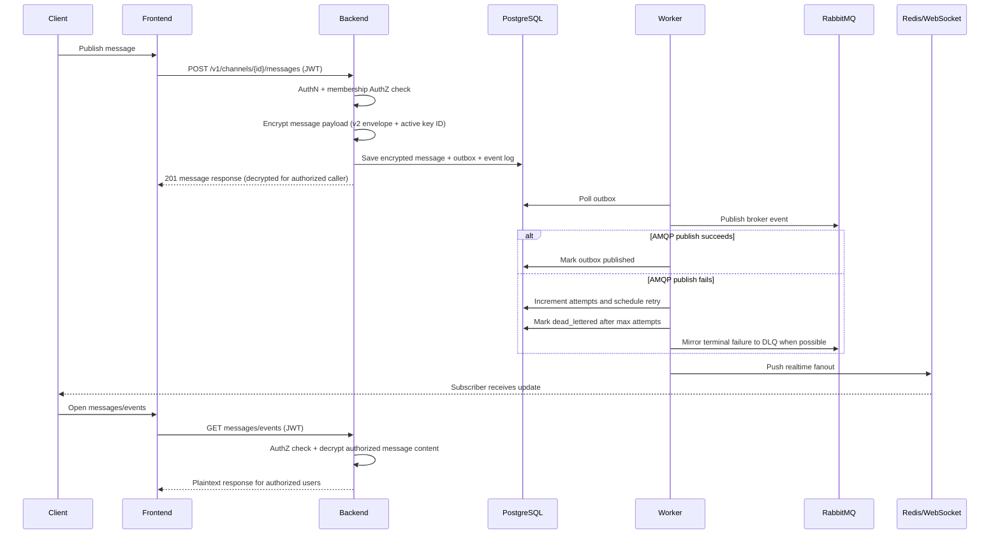

# Architecture

## Platform administration boundary

Global administration is modeled independently from channel membership. `users.is_superadmin` guards `/v1/admin/*`; the admin service aggregates system/channel audit events and controls normal-user account state, sessions, channel soft deletion/restoration, and global delivery recovery. Each mutation writes an audit event. This privilege does not alter RabbitMQ topic membership and does not bypass private message/upload read authorization.

## Component Responsibilities
- Backend (FastAPI)
  - Exposes REST + WebSocket endpoints.
  - Enforces authentication/authorization.
  - Encrypts/decrypts authorized message content through the versioned data-key ring.
  - Encrypts upload bytes into authenticated chunk frames and streams authorized decryption.
  - Persists domain data and emits outbox/event entries.
- Worker
  - Polls outbox entries.
  - Publishes routing events to RabbitMQ.
  - Applies idempotent broker bind/unbind desired-state commands from the same transactional outbox.
  - Tracks delivery attempts, retry scheduling, and dead-letter transitions.
  - Supports realtime fanout integration with bounded Redis retry/requeue backoff.
- RabbitMQ
  - Broker for publish/subscribe routing across services.
  - Includes a durable dead-letter exchange/queue for operational visibility.
- Redis + WebSocket
  - Low-latency delivery path for active subscribers.
  - Targeted membership updates are allowed through the socket even when the new channel is not yet in the socket subscription set, so approval-after-connect can refresh and subscribe safely.
- PostgreSQL
  - Source of truth for users, channels, memberships, messages, normalized message/upload attachment links, outbox, and events.
- Frontend (Next.js)
  - User workflows: auth, channels, join/leave, publish/read, event logs.
  - Keeps access JWTs in memory only; browser refresh is an HttpOnly-cookie + CSRF flow.
  - Delivery Monitor for channel owners/admins to inspect and retry failed outbox delivery.
  - Event Log integrity check for channel owners/admins.
- Nginx (recommended hardened Compose path)
  - Is the only published service in `docker-compose.hardened.yml`.
  - Overwrites the single forwarded client address and applies body/header,
    connection, buffering, and inactivity bounds before proxying REST/WebSocket/UI traffic.
- Nginx (production path)
  - Is the only host-published service in `docker-compose.production.yml`.
  - Terminates TLS, redirects HTTP, validates the public host, blocks internal readiness/docs, and sets browser security headers/CSP.

## High-Level Architecture


## Direct development and proxy-bounded deployment

`docker-compose.yml` remains the convenient local development/demo topology with
direct published service ports. `docker-compose.hardened.yml` is the recommended
HTTP resource-protection path: only Nginx publishes port 8080, while backend,
frontend, PostgreSQL, RabbitMQ, and Redis stay on an internal Docker network.
The proxy has a fixed private address and the backend trusts only that `/32` for
a single overwritten `X-Forwarded-For` value. Direct mode has an empty trusted
proxy list and ignores arbitrary forwarding headers.

Nginx buffers ordinary upstream responses, so a slow downstream reader does not
necessarily hold the FastAPI stream for the entire client duration. Per-IP and
server connection zones bound admitted proxy work, and `send_timeout` closes
connections that make no write progress for the configured interval. This is
not a minimum-throughput guarantee; sustained trickle clients within the limits,
OS file-descriptor/socket tuning, TLS, and multi-replica coordination remain
operator/deployment responsibilities.

## Production-oriented deployment

`docker-compose.production.yml` adds a distinct single-host production boundary:



Only Nginx joins both `edge` and `internal` networks and only its 80/443 mappings
are published. PostgreSQL, RabbitMQ, Redis, backend, worker, and frontend have no
host port bindings. Internal AMQP and Redis are authenticated but remain
plaintext on the host-local private network.

PostgreSQL initialization creates a distinct runtime login. The `migrate`
service connects with the administrative credential, applies Alembic and schema
repair, then grants CRUD/schema/sequence use to the runtime role. Backend and
worker share that non-superuser role and cannot create databases or roles.
Backend startup itself is Uvicorn-only. Superadmin provisioning runs only from
the explicit `bootstrap` profile.

Backend, worker, frontend, migration/bootstrap, and proxy processes are
non-root. Application/proxy roots are read-only with all capabilities dropped,
`no-new-privileges`, resource limits, and narrow writable locations: uploads for
backend, Next cache for frontend, rendered Nginx config, and per-service tmpfs.

The public `/health` endpoint returns only `{"status":"ok"}`. Docker accesses
the detailed `/ready` endpoint internally, while Nginx returns 404 for `/ready`
and `/v1/ready`. Production FastAPI docs are disabled by default.

The frontend calls the browser-specific auth routes. Login returns an access
JWT only and sets a rotating HttpOnly refresh cookie plus readable random CSRF
cookie. Refresh/logout require the cookie, exact allowed Origin, and matching
`X-CSRF-Token`. Access tokens live only in the process-memory Zustand store;
after reload the app refreshes before loading `/me`. WebSocket ticket issuance
continues to use the memory bearer token and the socket URL contains only the
existing opaque single-use ticket.

## Message Lifecycle


## Phase 9 data-at-rest architecture

`DATA_ENCRYPTION_KEYS` is a bounded deployment-injected map of at most 32 safe
key IDs to URL-safe base64 32-byte master keys. `DATA_ENCRYPTION_ACTIVE_KEY_ID`
selects all new writes. Historical IDs remain readable while configured; the
runtime never tries every key when a referenced ID is unknown.

Master keys are domain-separated with HKDF-SHA256:

- message v2: `info = MessagingSystem/message/v2`, then Fernet for the bounded message payload;
- upload v1: `salt = upload UUID`, `info = MessagingSystem/upload/v1`, then AES-256-GCM for file chunks.

Text rows use `enc:v2:<key-id>:<fernet-token>`. JSON rows use the strict single
field envelope `{"_enc_v2":{"kid":"...","token":"..."}}`. The worker and
RabbitMQ carry those encrypted fields unchanged. Only an authorized backend
REST/WebSocket boundary decrypts them.

New uploads are encrypted during the original request stream. No complete
plaintext temporary file is created:

```text
request.stream -> 64 KiB plaintext buffer -> SHA-256 + AES-GCM frame
               -> encrypted sibling temp -> fsync -> create-only finalization
```

`size_bytes`, `checksum`, and quota calculations retain logical plaintext
semantics. Physical ciphertext is larger because every frame carries an AEAD
tag and framing. After authorization, path containment, and download admission,
the backend authenticates the header and yields decrypted 64 KiB chunks through
`LeasedEncryptedFileResponse`. Database/audit work finishes before the slow
transfer, and the existing lease releases exactly once on completion,
cancellation, send failure, or integrity failure. Encrypted downloads reject
HTTP Range because ciphertext offsets are not plaintext offsets.

Migration `0022_phase9_upload_encryption` adds only metadata. Existing data is
converted explicitly with `python -m app.db.crypto_tool`; message batches update
storage fields without outbox/audit publication, and upload batches use fsynced
same-directory ciphertext plus atomic replacement. The encrypted header is
self-identifying, so a restart repairs the recoverable window where file
replacement succeeded before the database metadata commit.

Production injects the key ring into backend/migration/bootstrap processes.
The worker receives database, RabbitMQ, and Redis configuration only; Nginx and
the frontend never receive data-at-rest keys.

## Event Logging Points
- `channel.created`
- `membership.*` events
- `message.published`
- `security.unauthorized_publish`
- `security.unauthorized_read`
- `broker.retry_scheduled`
- `broker.dead_lettered`
- `broker.manual_retry_requested`

Events are stored in the `events` table and shown in the frontend event-log subpage under channel details.

## Event Log Integrity
Event Integrity Upgrade v1 adds a tamper-evident hash chain to the audit log.

- New event columns: `previous_hash`, `event_hash`, `hash_algorithm`, `integrity_version`, and `integrity_scope`.
- Channel-scoped events use `integrity_scope = "channel:<channel_id>"`.
- Non-channel events use the separate `system` scope.
- New backend events created through `log_event` and worker-created broker delivery events receive SHA-256 hashes.
- The canonical hash payload includes stable event fields: event id, channel id, actor user id, event type, created timestamp, event payload, previous hash, integrity version, and integrity scope.
- Canonical JSON is serialized with sorted keys and compact separators before SHA-256 hashing.
- `GET /v1/channels/{channel_id}/events/integrity` verifies the chain for a channel and returns only summary status, counts, hashes, and the first broken event id if any.
- The frontend Event Log page includes an Audit Integrity badge and a Verify Integrity button.

This is a practical hash-chain integrity layer, not a blockchain and not external notarization. It detects later modification, insertion, reordering, and deletion that breaks links between remaining events, but tail truncation requires an external remembered last hash to prove. A database administrator who can rewrite all event rows and hashes can still forge a new chain. Existing legacy events need `python scripts/backfill_event_integrity.py` before they can verify as initialized.

## Delivery Reliability
- PostgreSQL remains the source of truth for outbox state.
- Outbox records now track `pending`, `publishing`, `published`, `retry_scheduled`, `failed`, and `dead_lettered` states, along with attempts, max attempts, next retry time, last sanitized error, publish time, and dead-letter time.
- The worker polls only due records (`pending` and due `retry_scheduled`) so failures are not hammered in a tight loop.
- Each worker transaction claims one existing outbox row and at most one broker-binding projection row. Authoritative retry/dead-letter state commits before the separate best-effort diagnostic event transaction, so the worker never waits for an event-integrity advisory lock while retaining a broker-binding row lock.
- Failed publishes use exponential backoff with environment-controlled defaults (`OUTBOX_MAX_ATTEMPTS`, retry delay, multiplier, and cap).
- Membership create/approve/add/remove/leave, channel delete/restore, and slug updates modify a versioned `broker_binding_states` projection in the same transaction as the authoritative database change and enqueue a generation snapshot. The worker locks that pair, ignores stale generations, re-derives current membership/channel state, unbinds every retained obsolete key, and applies the current key idempotently. Rabbit success followed by a worker crash is safe because the uncommitted database acknowledgement rolls back and the retry repeats the full projection.
- WebSocket reconnect enqueues both desired-bound and desired-unbound states for that user; `python -m app.db.reconcile_broker_bindings` enqueues the complete PostgreSQL projection for operator repair.
- Channel membership generations are serialized on the channel row and copied into realtime outbox events. Before decrypting a channel message, the WebSocket layer compares the event generation with its short-lived authorization cache and refreshes PostgreSQL immediately for newer or legacy events. A missed Redis removal signal therefore cannot authorize a newly published post-removal message.
- Established WebSockets have a repository-controlled 16 KiB inbound frame/message ceiling at both Docker Uvicorn and application parsing. Each socket owns fixed-cardinality command/history token buckets and one dispatch lock. Subscribe/resume history shares one total per-command row cap rather than multiplying it per channel; a repeated identical subscribe/cursor returns an empty acknowledgement without repeating history work. Socket budget/cache state is removed on disconnect.
- REST `/sync` preserves `(channel UUID, sequence)` ordering and uses `LIMIT remaining` per channel under one global page budget. It performs at most 100 bounded message queries and materializes at most the requested limit (maximum 500), rather than loading all missed history.
- Protected upload GET responses authorize and finish database work first, then stream bounded authenticated plaintext from encrypted storage through `LeasedEncryptedFileResponse` (legacy migration-window plaintext alone uses `FileResponse`). One per-process atomic admission decision reserves user, trusted client-IP, and backend-global capacity; its idempotent lease releases every dimension on completion, cancellation, file/stat/integrity failure, ASGI send failure, or response construction failure. Active-key maps are bounded by the process-global cap because zero-count entries are removed.
- Message-attachment reads inherit channel lifecycle: channel-derived authorization requires an active channel, non-deleted message, and approved current membership. Upload ownership remains an independent authorization source across channel/message deletion; superadmin status alone is not a private-media read grant. Migration `0021_phase7_attachment_integrity` makes `messages.channel_id` authoritative through a composite `(message_id, channel_id)` foreign key after normalizing historical relation rows.
- Targeted invites are one-use; generic invite links are reusable until revoke, expiry, or channel deletion. Acceptance/revocation/deletion lock the channel before the invite row, establishing one database ordering. An email target that belongs to an existing account is resolved at issuance and stores authoritative immutable `invited_user_id` plus a normalized email snapshot. An unresolved/pre-registration email target can be accepted only by an account whose exact normalized current email has non-null `email_verified_at`; profile email changes clear that timestamp. Generic acceptances are audited per effective membership transition and do not consume global `accepted_at` state.
- Per-user RabbitMQ queues are bounded realtime buffers: default unused expiry is seven days, message TTL is 24 hours, and maximum length is 10,000 with oldest-message eviction. PostgreSQL message history and REST `/sync` recover anything missed or evicted.
- RabbitMQ-to-Redis forwarding retries Redis with exponential delay, then delays again before NACK/requeue. A Redis outage therefore produces paced retries rather than an immediate hot requeue loop.
- API fixed-window rate counters use one Redis Lua operation for increment plus first-hit TTL. During Redis failure, the per-process fallback never evicts an active key for churn; it reclaims expired windows and denies unseen sensitive keys at its configured capacity. Low-risk allow-policy reads remain independent of fallback saturation.
- After max attempts, the worker marks the row `dead_lettered` in PostgreSQL and tries to mirror the payload to RabbitMQ `ex.channels.dlx` / `q.dead.messages`.
- The admin delivery APIs and frontend Delivery Monitor are scoped to channels the current user manages.
- The DLQ is operational evidence only; the database status is the authoritative record.
- `scripts/verify_delivery_reliability.py` provides a supervisor-facing proof of the normal worker publish path plus a controlled dead-letter/manual retry path. It does not replace a future full broker-outage CI test.

Transactions that combine lifecycle rows, topology projection, and event-chain
integrity follow the global ordering in [`backend/docs/LOCK_ORDERING.md`](LOCK_ORDERING.md).
The policy keeps locks scoped to the affected user/channel rather than using a
global application mutex. PostgreSQL can still report an unrelated deadlock or
serialization failure; only the idempotent post-commit worker diagnostic write
has a narrow three-attempt retry for SQLSTATE `40P01`/`40001`.
