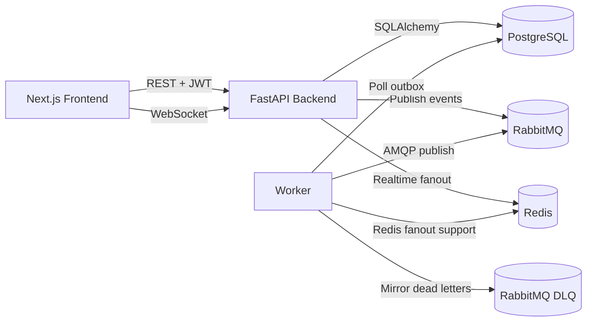
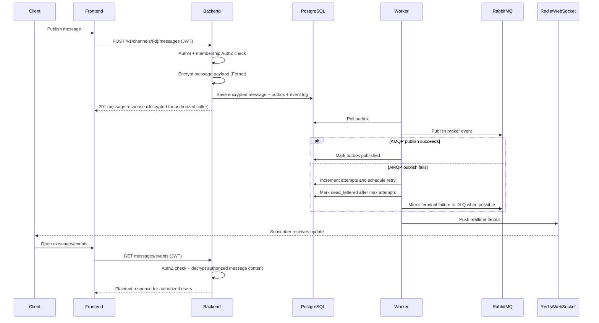

# Architecture

## Component Responsibilities
- Backend (FastAPI)
  - Exposes REST + WebSocket endpoints.
  - Enforces authentication/authorization.
  - Encrypts/decrypts message content.
  - Persists domain data and emits outbox/event entries.
- Worker
  - Polls outbox entries.
  - Publishes routing events to RabbitMQ.
  - Tracks delivery attempts, retry scheduling, and dead-letter transitions.
  - Supports realtime fanout integration.
- RabbitMQ
  - Broker for publish/subscribe routing across services.
  - Includes a durable dead-letter exchange/queue for operational visibility.
- Redis + WebSocket
  - Low-latency delivery path for active subscribers.
- PostgreSQL
  - Source of truth for users, channels, memberships, messages, outbox, and events.
- Frontend (Next.js)
  - User workflows: auth, channels, join/leave, publish/read, event logs.
  - Delivery Monitor for channel owners/admins to inspect and retry failed outbox delivery.

## High-Level Architecture

## Message Lifecycle

## Event Logging Points
- `channel.created`
- `membership.*` events
- `message.published`
- `security.unauthorized_publish`
- `security.unauthorized_read`
- `broker.retry_scheduled`
- `broker.dead_lettered`
- `broker.manual_retry_requested`

Events are stored in `events` table and shown in frontend channel details.

## Delivery Reliability
- PostgreSQL remains the source of truth for outbox state.
- Outbox records now track `pending`, `publishing`, `published`, `retry_scheduled`, `failed`, and `dead_lettered` states, along with attempts, max attempts, next retry time, last sanitized error, publish time, and dead-letter time.
- The worker polls only due records (`pending` and due `retry_scheduled`) so failures are not hammered in a tight loop.
- Failed publishes use exponential backoff with environment-controlled defaults (`OUTBOX_MAX_ATTEMPTS`, retry delay, multiplier, and cap).
- After max attempts, the worker marks the row `dead_lettered` in PostgreSQL and tries to mirror the payload to RabbitMQ `ex.channels.dlx` / `q.dead.messages`.
- The admin delivery APIs and frontend Delivery Monitor are scoped to channels the current user manages.
- The DLQ is operational evidence only; the database status is the authoritative record.
